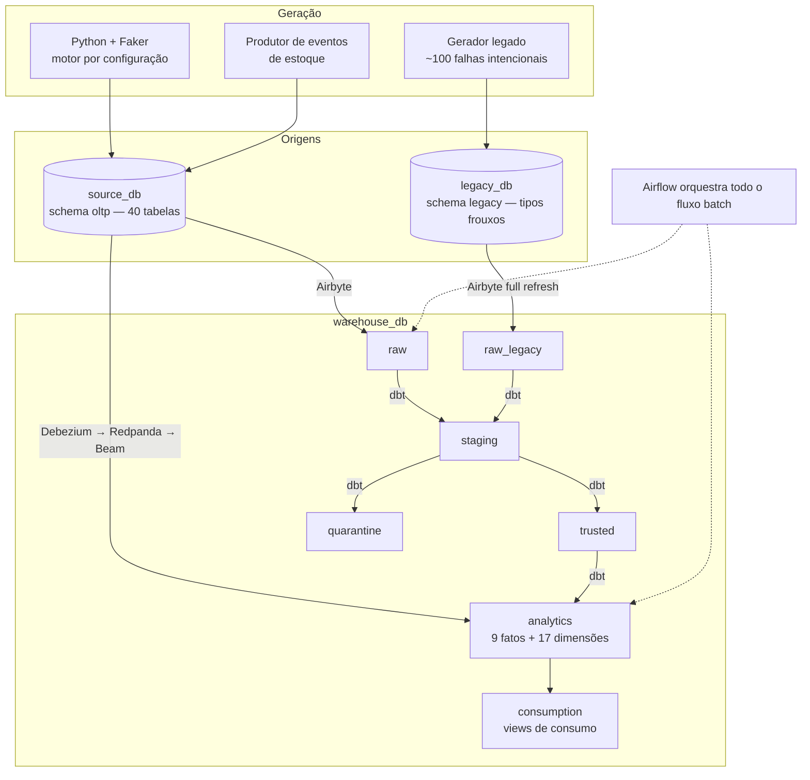

# Arquitetura de Referência

> **O que vive aqui:** como o sistema é construído — topologia, camadas, componentes, paridade
> local ↔ GCP e organização do repositório.
>
> **O que não vive aqui:** objetivo, escopo e regras do projeto (ver
> [Termo de Abertura](../Abertura_de_projeto.md)); o que é modelado (ver
> [Modelo de Dados](modelo_de_dados.md)); a ordem de construção (ver
> [Plano de Desenvolvimento](plano_de_desenvolvimento.md)); as escolhas ainda abertas (ver
> [Registro de Decisões](adr/README.md)); as regras sobre os dados (ver
> [Política de Governança de Dados](governanca_de_dados.md)).

| Campo | Informação |
|---|---|
| Versão | 2.3 |
| Situação | Componentes, camadas e paridade decididos — nenhum item pendente |
| Última revisão | 04/09/2026 |

---

## 1. Topologia



A separação entre `source_db`, `legacy_db` e `warehouse_db` torna a ingestão observável e impede
que o pipeline analítico consulte diretamente as tabelas das aplicações — a mesma separação que
existirá entre Cloud SQL e BigQuery.

O fluxo é unidirecional: nenhuma camada lê de uma camada posterior à sua. Governança e qualidade
acompanham cada camada desde a sua criação (princípio **P3**), em vez de serem etapas finais.

---

## 2. Camadas de dados

Os schemas e a separação entre estágio do fluxo e schema estão fixados em
[ADR-0008](adr/0008-schemas-do-armazem.md), com `governance` acrescentado pelo
[ADR-0023](adr/0023-escopo-do-schema-governance.md) e `snapshots` pelo
[ADR-0017](adr/0017-chaves-substitutas-e-scd.md) — **nove ao todo**. A materialização de cada camada
está no [ADR-0016](adr/0016-materializacao-por-camada.md); as contagens de objetos, no
[Modelo de Dados](modelo_de_dados.md#6-camadas-no-armazém).

| Camada | Conteúdo | Transformações permitidas | Consumidor |
|---|---|---|---|
| `raw` | Cópia fiel da origem principal | Nenhuma além de metadados de carga | Apenas o pipeline |
| `raw_legacy` | *Snapshot* imutável da origem legada | Nenhuma — o valor recebido é preservado | Apenas o pipeline |
| `staging` | Dados tipados, padronizados e deduplicados | Conversão de tipo, normalização, chaves técnicas | Apenas o pipeline |
| `trusted` | Regras de negócio aplicadas e validadas; legado tratado e empilhado | Regras de negócio, enriquecimento, correções documentadas | Pipeline e análise exploratória |
| `analytics` | Modelagem dimensional | Agregação, conformação de dimensões, SCD | `consumption` |
| `consumption` | Views de consumo — contratos estáveis de leitura | Somente seleção e apresentação | Perfil de análise |
| `quarantine` | Registros rejeitados com código e motivo | Nenhuma — é destino, não passagem | Auditoria |
| `governance` | Log de execução, reconciliação, índice de quarentena e classificação aplicada | Nenhuma — é registro, não passagem | Governança e auditoria |
| `snapshots` | Destino dos `dbt snapshot` que historizam as dimensões SCD tipo 2 | Nenhuma — mantido pelo dbt | Apenas o pipeline |

Regras válidas para todas as camadas:

- cada camada é um **schema explícito** — separação física, nunca convenção informal de nomes;
- toda tabela carrega metadados de carga (identificador de lote e *timestamp*);
- a reconstrução de qualquer camada a partir da anterior é **idempotente**;
- nenhuma camada é editada manualmente; correções nascem de código versionado;
- nenhum registro é descartado em silêncio — o que não passa vai para `quarantine` com motivo;
- `governance` e `snapshots` ficam **fora do fluxo**: nenhum modelo de `analytics` ou `consumption`
  lê de `governance`, sob pena de a auditoria virar entrada do que ela audita.

---

## 3. Componentes — fase local

| Papel | Escolha | Situação |
|---|---|---|
| Bancos transacional e analítico | PostgreSQL em contêiner (`source_db`, `legacy_db`, `warehouse_db`) | Firmada |
| Geração de dados | Python + `Faker`, orientada a configuração | [ADR-0005](adr/0005-geracao-com-faker-orientada-a-configuracao.md) |
| Ingestão | **Airbyte** | [ADR-0003](adr/0003-stack-airbyte-dbt-airflow.md) |
| Transformação, testes, documentação e linhagem | **dbt** | [ADR-0003](adr/0003-stack-airbyte-dbt-airflow.md) |
| Orquestração | **Airflow** | [ADR-0003](adr/0003-stack-airbyte-dbt-airflow.md) |
| Captura de mudanças | **Debezium** sobre **Kafka Connect** | [ADR-0006](adr/0006-streaming-de-estoque-com-cdc-e-beam.md) · [ADR-0020](adr/0020-debezium-sobre-kafka-connect.md) |
| Transporte de eventos | **Redpanda** | [ADR-0006](adr/0006-streaming-de-estoque-com-cdc-e-beam.md) |
| Processamento contínuo | **Apache Beam** com `DirectRunner` | [ADR-0006](adr/0006-streaming-de-estoque-com-cdc-e-beam.md) |
| Interface de operação | `Makefile` + comandos de terminal | Firmada |
| Testes de dados | `dbt` + `dbt-expectations`; `pytest` para código | [ADR-0003](adr/0003-stack-airbyte-dbt-airflow.md) |
| Acesso a dados em Python | **SQLAlchemy** — os modelos são a fonte de verdade do schema | [ADR-0009](adr/0009-sqlalchemy-para-acesso-a-dados.md) |
| Migração de schema | **Alembic**, derivando as migrações dos modelos | [ADR-0010](adr/0010-alembic-para-migracoes.md) |
| Ambiente e dependências Python | **`uv`**, com Python 3.11 e `uv.lock` versionado | [ADR-0026](adr/0026-uv-para-ambiente-e-dependencias.md) |
| Controle de versão | Git + GitHub | Firmada |

### 3.1 Operação pelo terminal

Toda a infraestrutura local é abstraída em alvos de `Makefile` — `make up`, `make seed-data`,
`make sync-airbyte`, `make dbt-build`, `make stream-up`. A consequência arquitetural é relevante:
com o ciclo de vida inteiro atrás de comandos, a migração para a nuvem troca o **conteúdo** dos
alvos, não o modo de operar. Os comandos concretos vivem em [Execução Local](execucao_local.md).

---

## 4. Componentes — fase GCP

| Papel | Escolha | Situação |
|---|---|---|
| Banco transacional | Cloud SQL for PostgreSQL | Firmada |
| Data Warehouse | BigQuery | Firmada |
| Infraestrutura como código | **Terraform** | [ADR-0004](adr/0004-terraform-como-iac.md) |
| Captura de mudanças | Datastream | [ADR-0006](adr/0006-streaming-de-estoque-com-cdc-e-beam.md) |
| Transporte de eventos | Pub/Sub | [ADR-0006](adr/0006-streaming-de-estoque-com-cdc-e-beam.md) |
| Processamento contínuo | Dataflow (mesmo código Beam) | [ADR-0006](adr/0006-streaming-de-estoque-com-cdc-e-beam.md) |
| Transformação | dbt, com adaptação de dialeto | Firmada |
| Orquestração | **Cloud Composer**, em janela curta | [ADR-0024](adr/0024-airbyte-e-airflow-no-gcp.md) |
| Ingestão *batch* | **Airbyte em contêiner**, provisionado por Terraform, em janela curta | [ADR-0024](adr/0024-airbyte-e-airflow-no-gcp.md) |
| Catálogo corporativo | Dataplex, alimentado pelo `manifest.json` do dbt | [ADR-0007](adr/0007-catalogo-como-codigo.md) |

Boas práticas previstas no BigQuery: **um dataset por camada**, **particionamento** por data de
evento nas tabelas de fato, **clustering** pelas chaves de filtro mais frequentes, **rótulos** para
custo e propriedade, e **policy tags** aplicadas a partir da classificação de sensibilidade
declarada no dbt.

Particionamento, *clustering*, retenção, políticas de acesso e custos são definidos **antes** do
provisionamento.

> **Opção futura, não adotada:** com a orquestração inteiramente abstraída em comandos e em
> Terraform, é possível traduzir os modelos dbt para o **Dataform**, nativo do BigQuery, caso se
> queira simplificar ainda mais a operação na nuvem. Isso **não** faz parte do plano — está
> registrado apenas para que a possibilidade não se perca, e exigiria ADR próprio.

---

## 5. Mapa de paridade local ↔ GCP

Este mapa cumpre o princípio **P4**: nenhuma decisão local pode exigir reprojeto na nuvem. Uma
decisão só é aceitável se tiver uma linha correspondente aqui.

| Conceito | Fase local | Fase GCP |
|---|---|---|
| Origem transacional | PostgreSQL em contêiner | Cloud SQL for PostgreSQL |
| Camada de dados | Schema no `warehouse_db` (nove) | Dataset no BigQuery |
| Fato / dimensão | Tabela no schema `analytics` | Tabela particionada e clusterizada |
| View de consumo | View no schema `consumption` | *Authorized view* em dataset próprio |
| Ingestão *batch* | Airbyte local | Airbyte em contêiner, por Terraform ([ADR-0024](adr/0024-airbyte-e-airflow-no-gcp.md)) |
| Transformação | dbt | dbt, com adaptação de dialeto |
| Orquestração | Airflow local | Cloud Composer ([ADR-0024](adr/0024-airbyte-e-airflow-no-gcp.md)) |
| Captura de mudanças | Debezium sobre Kafka Connect | Datastream |
| Transporte de eventos | Redpanda | Pub/Sub |
| Processamento contínuo | Beam / `DirectRunner` | Beam / Dataflow |
| Controle de acesso | *Roles* e *grants* do PostgreSQL | IAM por dataset + *policy tags*, aplicadas a partir do YAML por fluxo automatizado ([ADR-0025](adr/0025-policy-tags-por-fluxo-automatizado.md)) |
| Catálogo e linhagem | `.yml` do dbt + `dbt docs` | Os mesmos `.yml` publicados no Dataplex |
| Versionamento de schema | Migrações versionadas | As mesmas migrações + DDL versionado |
| Infraestrutura | Docker Compose | Terraform |
| Segredos | `.env` local | Secret Manager |

---

## 6. Decisões estruturais firmadas

Valem para as duas fases e independem das ferramentas:

1. **Camadas explícitas e nomeadas** — separação física, não convenção de nome de tabela.
2. **Schema versionado por migração** — nenhuma alteração estrutural aplicada manualmente; o banco
   é reconstruível do zero a partir do repositório.
3. **Execução reproduzível a partir do repositório** — ambiente, dados e pipeline nascem de código
   versionado.
4. **Fluxo unidirecional** — nenhuma camada depende de camada posterior.
5. **Separação entre origem e armazém** — o analítico nunca consulta as tabelas da aplicação.
6. **Portabilidade antes de otimização** — entre duas soluções equivalentes, vence a que tem
   contrapartida direta no GCP.

As regras sobre a natureza dos dados e sobre segredos são política de governança e vivem na
[Política de Governança de Dados](governanca_de_dados.md).

---

## 7. Organização do repositório

Estrutura fixada pelo [ADR-0012](adr/0012-repositorio-com-pacote-instalavel.md). Diretórios marcados nascem na etapa indicada no
[Plano de Desenvolvimento](plano_de_desenvolvimento.md).

```text
mvp_ed1/
├── README.md                     # porta de entrada e mapa da documentação
├── CLAUDE.md                     # convenções de trabalho e desenvolvimento assistido
├── Abertura_de_projeto.md        # Termo de Abertura
├── Makefile                      # (Etapa 2) interface de operação
├── alembic.ini                   # (Etapa 3) configuração das migrações, sem credencial
├── docs/
│   ├── arquitetura.md
│   ├── plano_de_desenvolvimento.md
│   ├── modelo_de_dados.md
│   ├── geracao_de_dados.md
│   ├── origem_legada.md
│   ├── streaming.md
│   ├── capacidade_e_recuperacao.md
│   ├── qualidade_de_dados.md
│   ├── governanca_de_dados.md
│   ├── dicionario_de_dados.md
│   ├── execucao_local.md
│   ├── glossario.md
│   ├── referencias.md
│   ├── glossario_de_negocio/     # blocos  importados pelo dbt
│   └── adr/
├── docker/                       # (Etapa 2) composição do ambiente local
├── airbyte/                      # (Etapa 5) ingestão como código
│   ├── streams.yml               #           modo de sincronização por tabela (ADR-0015)
│   ├── values.yaml               #           dimensionamento dos jobs no cluster local
│   └── *.tf                      #           fonte, destino e conexão (ADR-0004)
├── db/                           # (Etapa 3) migrações Alembic e seeds
│   ├── migrations/               # env.py + versions/ derivadas dos modelos
│   └── seeds/
├── pyproject.toml                # (Etapa 2) pacote, interpretador e dependências
├── uv.lock                       # (Etapa 2) trava de versões — versionado
├── .python-version               # (Etapa 2) interpretador declarado: 3.11
├── src/
│   └── mvp_ed1/                  # (Etapa 2) pacote instalável, importado por caminho absoluto
│       ├── db.py                 # (Etapa 4) URL de conexão a partir do ambiente
│       ├── models/               # (Etapa 3) as 40 tabelas — fonte de verdade do schema
│       ├── generator/            # (Etapa 4) motor, configuração declarativa e construtores
│       │   ├── geracao.yml       #           a declaração: proporções, piso, provedores
│       │   └── domains/          #           um construtor por domínio do modelo
│       ├── legacy/               # (Etapa 10) gerador da origem legada
│       └── streaming/            # (Etapa 7) produtor e pipeline Beam
├── dbt/                          # (Etapa 5) projeto dbt: modelos, testes, .yml
│   ├── dbt_project.yml           #           camada = schema, materialização por ADR-0016
│   ├── profiles.yml              #           conexão por variável de ambiente, sem segredo
│   └── models/{staging,trusted,analytics,consumption}/
├── airflow/                      # (Etapa 5) DAGs
├── terraform/                    # (Etapa 13) infraestrutura GCP
├── tests/                        # (Etapa 4) testes de código Python
├── .tools/                       # (Etapa 5) abctl e Terraform fixados; fora do Git
└── data/                         # artefatos locais, ignorados pelo Git
```

Convenções de nomenclatura, idioma e organização de arquivos estão no [`CLAUDE.md`](../CLAUDE.md).

---

## 8. Restrições que a arquitetura deve respeitar

Esta arquitetura está subordinada aos princípios **P1** (fluxo completo antes de sofisticação),
**P4** (paridade local ↔ GCP), **P6** (simplicidade arquitetural) e **P7** (privacidade por
desenho), e às restrições do [Termo de Abertura](../Abertura_de_projeto.md).

Na prática: **nenhum componente novo entra nesta arquitetura sem um ADR** que declare o problema
resolvido, o custo aceito e a contrapartida direta na fase GCP.

O conjunto Airbyte + Airflow + Redpanda + Debezium consome memória significativa em um ambiente
local. Executar tudo simultaneamente não é obrigatório: os alvos do `Makefile` permitem subir
apenas o subconjunto necessário a cada etapa — mitigação do risco **R11**.
