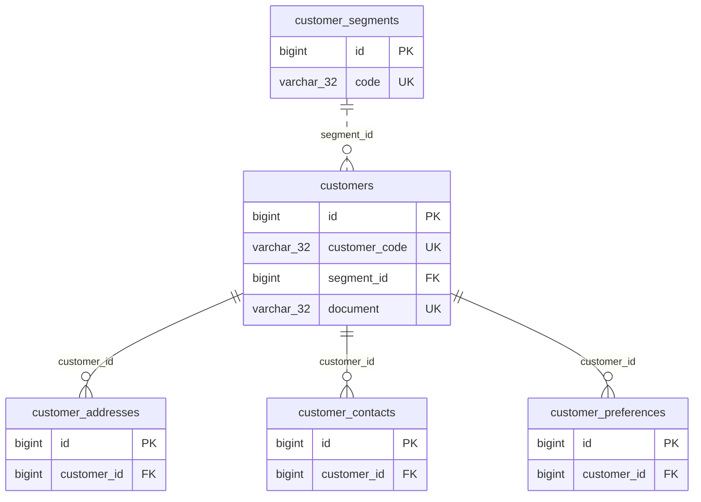
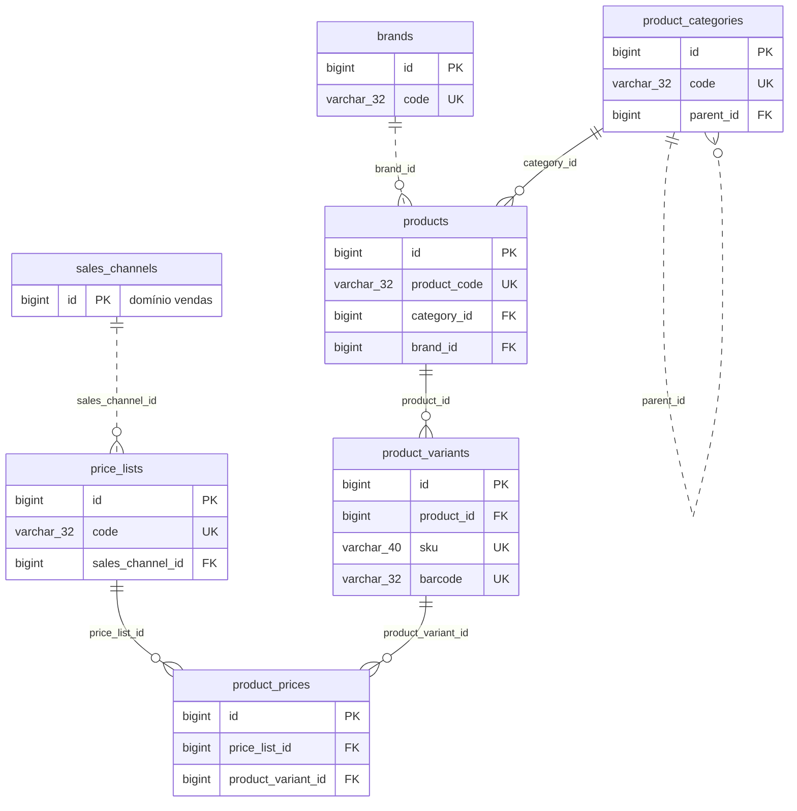
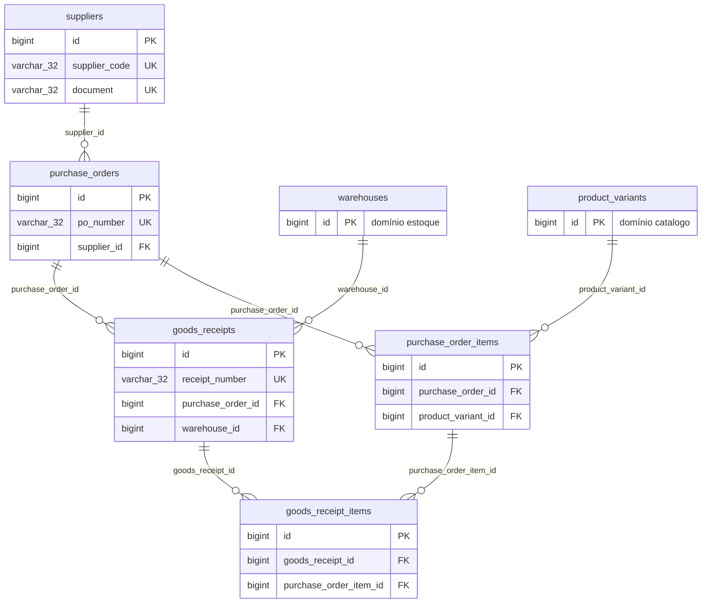
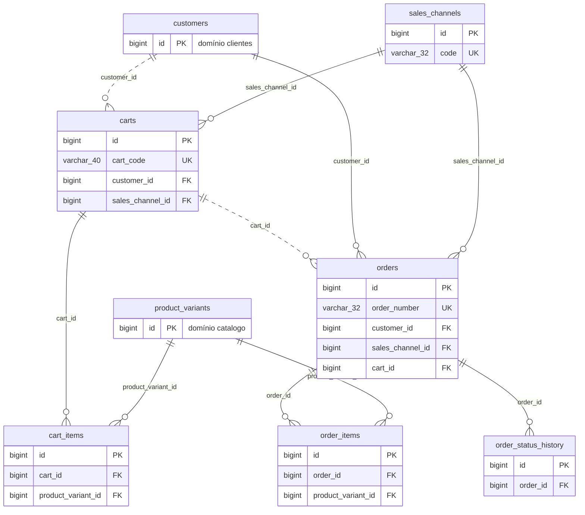
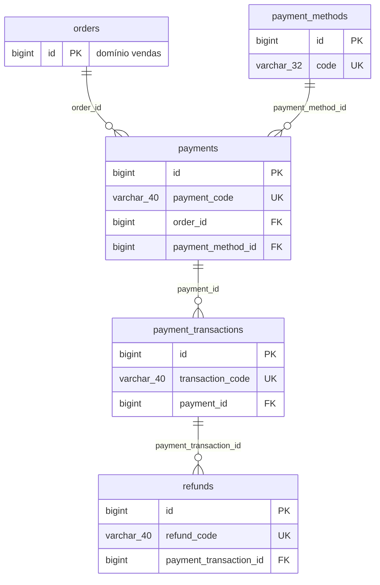
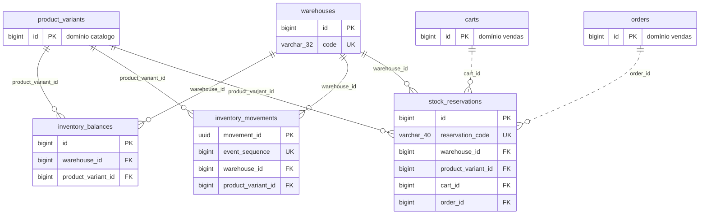
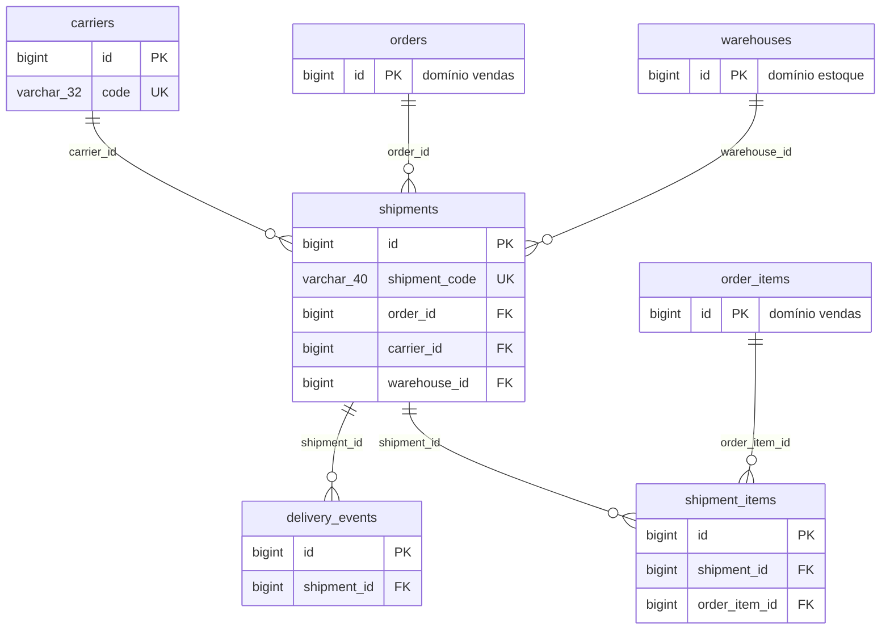
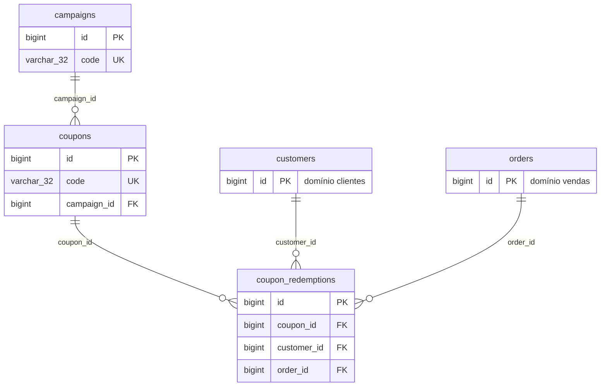
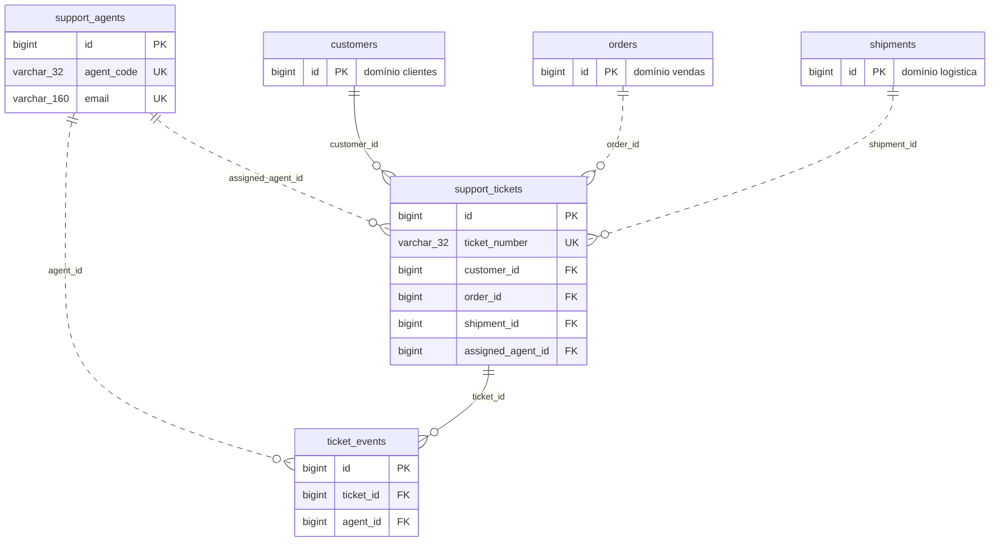

# Modelo de Dados

> **O que vive aqui:** o inventário do que é modelado — as 40 tabelas transacionais por domínio, o
> modelo dimensional (9 fatos e 17 dimensões), as invariantes de negócio e o contrato do evento de
> estoque.
>
> **O que não vive aqui:** como os dados são gerados (ver [Geração de Dados](geracao_de_dados.md));
> a definição campo a campo e a classificação (ver
> [Dicionário de Dados](dicionario_de_dados.md)); o dimensionamento do ambiente (ver
> [Capacidade e Recuperação](capacidade_e_recuperacao.md)); os testes (ver
> [Qualidade de Dados](qualidade_de_dados.md)).

| Campo | Informação |
|---|---|
| Domínio de negócio | Marketplace de varejo *omnichannel* ([ADR-0002](adr/0002-dominio-marketplace-omnichannel.md)) |
| Versão | 1.2 |
| Situação | Vigente — materializações, chaves substitutas e nomenclatura fixadas por ADR |
| Última revisão | 04/09/2026 |

As contagens de linhas são a **proporção de referência**, não resultados medidos e não compromissos
de tamanho: elas fixam a razão entre as tabelas, que é o que dá realismo ao domínio. O volume
efetivo é essa proporção multiplicada pelo fator de escala
([ADR-0014](adr/0014-volume-por-proporcoes-e-fator-de-escala.md)) — e no fator `dev` corresponde a
**um décimo** dos números abaixo. Os absolutos estão em
[Geração de Dados](geracao_de_dados.md).

Os nomes seguem o prefixo por tipo fixado no
[ADR-0013](adr/0013-nomenclatura-por-prefixo-de-tipo.md); toda tabela mutável carrega `deleted_at`
([ADR-0015](adr/0015-sincronizacao-e-exclusoes.md)) e toda tabela empilhada carrega `source_system`
([ADR-0021](adr/0021-procedencia-no-empilhamento.md)).

---

## 1. Origens

O projeto tem duas origens transacionais distintas, deliberadamente diferentes em qualidade:

| Origem | Banco | Estrutura | Papel |
|---|---|---|---|
| Principal | `source_db`, schema `oltp` | 40 tabelas normalizadas (3FN como referência), tipagem estrita, *constraints* completas | Sistema em operação, bem governado |
| Legada | `legacy_db`, schema `legacy` | Mesmos 40 nomes de tabela e mesmo significado de campos, com tipos flexíveis (`text`) e *constraints* relaxadas | Sistema antigo, sem governança, com falhas intencionais |

A estrutura legada é **logicamente idêntica**, não uma cópia literal do DDL normalizado: colunas
que precisam aceitar valores incompatíveis são declaradas como `text`, porque uma coluna tipada
como número ou data rejeitaria os exemplos defeituosos antes da engenharia de limpeza — que é
justamente o que se quer exercitar.

---

## 2. Modelo transacional — 40 tabelas em 9 domínios

<!-- gerado a partir dos modelos; não editar à mão -->

### 2.1 Clientes — 5 tabelas

| Tabela | Linhas | Finalidade |
|---|---:|---|
| `customer_contacts` | 24.000 | E-mails e telefones sintéticos associados ao cliente. |
| `customer_addresses` | 21.000 | Endereços de cobrança e entrega, com vigência e indicação de principal. |
| `customers` | 15.000 | Cadastro principal do cliente e estado do relacionamento. |
| `customer_preferences` | 15.000 | Preferências de comunicação, idioma e consentimentos simulados. |
| `customer_segments` | 8 | Segmentos comerciais associáveis ao cadastro do cliente. |

### 2.2 Catálogo e preços — 6 tabelas

| Tabela | Linhas | Finalidade |
|---|---:|---|
| `product_prices` | 12.000 | Preço de cada SKU em uma lista e intervalo de vigência. |
| `product_variants` | 6.000 | SKUs e variações de tamanho, cor ou embalagem. |
| `products` | 3.000 | Produto conceitual vendido pelo marketplace. |
| `brands` | 180 | Marcas associadas aos produtos. |
| `product_categories` | 80 | Hierarquia de categorias e subcategorias do catálogo. |
| `price_lists` | 5 | Listas de preço por canal, moeda e período de vigência. |

### 2.3 Fornecedores e compras — 5 tabelas

| Tabela | Linhas | Finalidade |
|---|---:|---|
| `purchase_order_items` | 16.000 | Produtos, quantidades e custos solicitados ao fornecedor. |
| `goods_receipt_items` | 15.200 | Quantidades efetivamente recebidas por item da ordem de compra. |
| `purchase_orders` | 4.000 | Cabeçalho das ordens de compra enviadas a fornecedores. |
| `goods_receipts` | 3.800 | Registro do recebimento físico de uma ordem de compra. |
| `suppliers` | 300 | Cadastro sintético dos fornecedores. |

### 2.4 Vendas — 6 tabelas

| Tabela | Linhas | Finalidade |
|---|---:|---|
| `cart_items` | **1.100.000** | Produtos e quantidades incluídos nos carrinhos; maior tabela do projeto. |
| `carts` | 400.000 | Carrinhos abertos, convertidos, abandonados ou expirados. |
| `order_status_history` | 175.000 | Histórico temporal das mudanças de estado do pedido. |
| `order_items` | 75.000 | Grão comercial do pedido: um SKU comprado em uma linha. |
| `orders` | 35.000 | Cabeçalho do pedido: cliente, canal, valores e estado atual. |
| `sales_channels` | 3 | Canais de venda como web, aplicativo e loja física. |

### 2.5 Pagamentos — 4 tabelas

| Tabela | Linhas | Finalidade |
|---|---:|---|
| `payment_transactions` | 71.500 | Tentativas, autorizações, capturas e falhas do pagamento. |
| `payments` | 36.750 | Intenção de pagamento associada ao pedido. |
| `refunds` | 1.400 | Reembolsos totais ou parciais de transações capturadas. |
| `payment_methods` | 6 | Tipos de pagamento aceitos, sem armazenar credenciais. |

### 2.6 Estoque — 4 tabelas

| Tabela | Linhas | Finalidade |
|---|---:|---|
| `inventory_movements` | 120.000 | Livro append-only de entradas, saídas, ajustes e transferências. |
| `stock_reservations` | 42.000 | Reserva de quantidade para carrinhos ou pedidos. |
| `inventory_balances` | 25.000 | Saldo atual de cada SKU por armazém. |
| `warehouses` | 5 | Centros de distribuição ou locais de estoque. |

### 2.7 Logística — 4 tabelas

| Tabela | Linhas | Finalidade |
|---|---:|---|
| `delivery_events` | 185.000 | Eventos de coleta, trânsito, tentativa e entrega. |
| `shipment_items` | 78.000 | Quantidades de itens de pedido incluídas em cada remessa. |
| `shipments` | 37.000 | Remessas criadas para atender pedidos. |
| `carriers` | 8 | Transportadoras sintéticas e suas modalidades. |

### 2.8 Marketing — 3 tabelas

| Tabela | Linhas | Finalidade |
|---|---:|---|
| `coupon_redemptions` | 6.000 | Uso efetivo de cupons por cliente e pedido. |
| `coupons` | 180 | Cupons, regras de desconto e limites de utilização. |
| `campaigns` | 28 | Campanhas de marketing e seus períodos de vigência. |

### 2.9 Atendimento — 3 tabelas

| Tabela | Linhas | Finalidade |
|---|---:|---|
| `ticket_events` | 18.000 | Interações, atribuições e mudanças de estado do chamado. |
| `support_tickets` | 4.000 | Solicitações associadas a clientes, pedidos ou entregas. |
| `support_agents` | 42 | Agentes sintéticos e suas equipes de atendimento. |

**Total na proporção de referência:** 2.545.495 linhas — 254.604 no fator `dev`, que é o padrão local.

<!-- fim do trecho gerado -->

`cart_items` é a maior tabela por construção: carrinhos com abandono, expiração e múltiplas
alterações antes da conversão produzem cerca de 2,7 itens por carrinho e 31 itens de carrinho por
pedido convertido. É essa razão, e não o número absoluto, que precisa sobreviver a qualquer fator.

`inventory_movements` alimenta o fluxo de streaming — o contrato do evento está na
[seção 5](#5-contrato-do-evento-de-estoque) —, e é a única tabela que cresce **além** da proporção
declarada: o produtor da [Etapa 7](streaming.md) acrescenta eventos ao livro depois da carga
inicial.

### 2.10 Desvios deliberados da 3FN

A terceira forma normal é a **referência**, não um dogma. O modelo se afasta dela em seis pontos, e
cada um tem motivo declarado. Desvio sem justificativa escrita é erro de modelagem; com
justificativa, é decisão.

| Onde | O desvio | Por que |
|---|---|---|
| `orders` — `subtotal_amount`, `discount_amount`, `shipping_amount`, `tax_amount`, `total_amount` | Valores deriváveis de `order_items` | São o preço **acordado no momento da compra**. Recalculá-los depois faria o total de um pedido antigo mudar quando uma lista de preços fosse corrigida — o pedido deixaria de ser um fato. A `CHECK` `total_reconcilia` impede que os cinco divirjam entre si |
| `order_items` — `total_amount` | Derivável de `quantity × unit_price − discount + tax` | O arredondamento para duas casas é **decisão de negócio**, não consequência aritmética. Guardar o resultado registra qual arredondamento foi aplicado; a `CHECK` tolera um centavo de diferença por isso |
| `orders` — `status` | Derivável do último registro de `order_status_history` | Toda consulta operacional filtra por estado. Derivar exigiria uma subconsulta correlacionada em toda leitura. O histórico continua sendo a fonte da verdade — o campo é projeção |
| `inventory_balances` — `quantity_on_hand` | Derivável da soma de `inventory_movements` | É o mesmo padrão que o [ADR-0019](adr/0019-saldo-em-deltas-com-entrega-idempotente.md) adota no *streaming*: eventos imutáveis como fonte, saldo como projeção. Somar 120 mil movimentos a cada consulta de disponibilidade é inviável em qualquer escala |
| `product_categories` — `depth` | Derivável de percorrer `parent_id` até a raiz | Evita consulta recursiva em toda navegação de catálogo. A `CHECK` limita a profundidade a três níveis, o que torna o valor verificável |
| `cart_items` e `order_items` — `unit_price` | Parece cópia de `product_prices` | **Não é desvio.** É um fato pontual no tempo: o preço praticado naquela transação. `product_prices` diz quanto custava; `order_items` diz quanto foi cobrado, e os dois podem legitimamente divergir |

Os três primeiros são **denormalização por imutabilidade do fato**; o quarto e o quinto, por
**custo de leitura**. Nenhum deles introduz risco de divergência silenciosa: os três primeiros têm
`CHECK` dentro da linha, e os dois últimos são reconciliados por teste de qualidade.

---

### 2.11 Diagrama entidade-relacionamento

<!-- gerado a partir dos modelos; não editar à mão -->

Um diagrama por domínio, **gerado** a partir dos modelos. Cada entidade mostra
apenas as chaves: a lista completa de campos vive no
[Dicionário de Dados](dicionario_de_dados.md), que é o dono desse conteúdo.

Relações que cruzam domínios aparecem no diagrama do domínio que **contém a
chave estrangeira**, com a tabela referenciada em cinza.

#### `clientes`

#### `catalogo`

#### `compras`

#### `vendas`

#### `pagamentos`

#### `estoque`

#### `logistica`

#### `marketing`

#### `atendimento`

<!-- fim do trecho gerado -->

---

## 3. Modelo dimensional — 27 tabelas em `analytics`

Não há fatos do tipo *snapshot*: todo processo é representado por eventos transacionais. As
métricas de estado ao longo do tempo são derivadas dos eventos, não de fotografias periódicas do
banco.

### 3.1 Tabelas fato — 10

Os **atributos e as medidas** de cada fato não estão fixados aqui: são derivados das perguntas de
negócio, conforme o [ADR-0018](adr/0018-fatos-e-views-a-partir-de-perguntas-de-negocio.md). Cada
medida, quando declarada, é classificada como **aditiva**, **semiaditiva** ou **não aditiva** — a
classificação que impede somar saldo de estoque ao longo do tempo.

| Tabela | Linhas | Grão | Tipo |
|---|---:|---|---|
| `fact_cart_event` | ~778.000 | Um evento de ciclo de vida de um carrinho. | Transacional |
| `fact_order_status_event` | 175.000 | Uma mudança de estado de um pedido. | Transacional |
| `fact_inventory_movement` | 120.000 na carga inicial; cresce com o *streaming* | Uma movimentação de SKU em um armazém. | Transacional |
| `fact_shipment_item` | 78.000 | Um item de pedido em uma remessa. | Transacional |
| `fact_sales_order_item` | 75.000 | Uma linha de item de pedido. | Transacional |
| `fact_payment_transaction` | 71.500 | Uma tentativa ou operação financeira. | Transacional |
| `fact_support_ticket_event` | 18.000 | Uma interação ou mudança de estado de chamado. | Transacional |
| `fact_purchase_order_item` | 16.000 | Um item de uma ordem de compra. | Transacional |
| `fact_coupon_redemption` | 6.000 | Um uso de cupom em um pedido. | Transacional |
| `fact_refund` | 1.400 | Um reembolso realizado. | Transacional |

`fact_inventory_movement` carrega **`cogs_amount`**, o custo do produto vendido, registrado no
instante da saída ([ADR-0030](adr/0030-cmv-do-livro-de-estoque.md)). É por ela que a margem é
calculada, e não pelo custo de compra: o custo do movimento não muda quando o preço de compra muda.

`fact_cart_event` é a décima fato, acrescentada pelo
[ADR-0028](adr/0028-fato-de-carrinho-para-o-funil.md) quando as perguntas de negócio mostraram que o
funil de conversão não tinha onde pousar. São até dois eventos por carrinho — a abertura e o
desfecho —, e é por isso que ela passa a ser a maior tabela de `analytics`: `carts` é a segunda
maior tabela da origem.

### 3.2 Dimensões — 17

A chave substituta é o *hash* determinístico da chave natural, e as sete dimensões SCD tipo 2 são
materializadas por `dbt snapshot` no schema `snapshots`
([ADR-0017](adr/0017-chaves-substitutas-e-scd.md)). Cada fato referencia a versão **vigente no
instante do evento**, não a versão corrente.

Toda dimensão carrega `is_deleted` e **nunca perde membro** por exclusão na origem
([ADR-0029](adr/0029-exclusao-logica-como-marca-na-dimensao.md)): o SKU que saiu do catálogo hoje
continua ali para que o pedido de 2024 que o comprou tenha a quem se juntar. Filtrar é decisão da
pergunta, tomada na view que a responde.

Uma armadilha da carga inicial, encontrada ao construir: o `dbt snapshot` marca `dbt_valid_from` no
instante da **primeira execução**, e sem tratamento todo evento anterior a ela fica sem versão à
qual se juntar — a fato sai vazia. A primeira versão de cada chave natural passa a valer desde
`period_start`, que é a leitura correta: ela representa o que se sabia na carga inicial.

| Tabela | Linhas | Conteúdo principal | Tratamento |
|---|---:|---|---|
| `dim_date` | 975 | Calendário de 01/01/2024 a 01/09/2026, inclusive. | Estática |
| `dim_time` | 1.440 | Hora, minuto e faixas do dia. | Estática |
| `dim_customer` | 16.500 | Perfil, segmento e estado do cliente. | SCD tipo 2 |
| `dim_geography` | 22 | Cidade, estado, região e país. | Conformada |
| `dim_product` | 6.600 | SKU, produto e atributos da variante. | SCD tipo 2 |
| `dim_category` | 88 | Hierarquia comercial de categorias. | SCD tipo 2 quando aplicável |
| `dim_brand` | 180 | Marca do produto. | SCD tipo 1 |
| `dim_supplier` | 330 | Fornecedor e atributos comerciais. | SCD tipo 2 |
| `dim_sales_channel` | 3 | Canal de venda. | SCD tipo 1 |
| `dim_warehouse` | 5 | Local de estoque e capacidade. | SCD tipo 2 |
| `dim_carrier` | 8 | Transportadora e modalidade. | SCD tipo 1 |
| `dim_campaign` | 28 | Campanha, objetivo e vigência. | SCD tipo 1 |
| `dim_coupon` | 198 | Regra e tipo de desconto. | SCD tipo 2 |
| `dim_payment_method` | 6 | Meio e modalidade de pagamento. | SCD tipo 1 |
| `dim_currency` | 1 | Moeda e código ISO. | Estática |
| `dim_support_category` | 6 | Motivo e categoria do chamado. | Derivada e conformada |
| `dim_support_agent` | 46 | Agente, equipe e período de atuação. | SCD tipo 2 |

Identificadores operacionais como `order_number`, `ticket_number` e `tracking_number` são mantidos
nas respectivas fatos como **dimensões degeneradas**.

**Totais:** aproximadamente **1,34 milhão de linhas nas fatos** e **26.400 nas dimensões**, na
proporção de referência — um décimo disso no fator `dev`.

Duas contagens desta seção foram corrigidas contra a geração real da Etapa 4, e é assim que elas
devem ser lidas: `dim_geography` cai de 1.500 para **22**, porque o gerador produz endereços sobre
22 localidades coerentes entre cidade, UF e CEP, cobrindo **14 unidades federativas e as cinco
regiões**. É o critério do [ADR-0014](adr/0014-volume-por-proporcoes-e-fator-de-escala.md) em ação:
o ambiente é dimensionado por **cobertura**, e uma dimensão que já contém todas as regiões não fica
melhor com mais linhas. `dim_support_category` cai de 12 para **6**, que é o número de categorias
que o modelo transacional aceita.

Históricos SCD representam mudanças de atributos de negócio — não são cópias de segurança nem
fotografias integrais do banco.

---

## 4. Invariantes de negócio

Estas regras orientam simultaneamente a **geração** dos dados e os **testes** de qualidade. Elas
são a definição de "dado coerente" neste projeto.

1. Todo item de pedido referencia um pedido e um SKU existentes.
2. O total do pedido reconcilia itens, descontos, frete, impostos simulados e arredondamentos.
3. Uma captura financeira nunca excede o valor autorizado sem uma nova autorização válida.
4. A soma dos reembolsos nunca excede o valor capturado.
5. Uma remessa não contém quantidade superior à quantidade vendida e ainda não enviada.
6. O recebimento de compra não supera a quantidade solicitada, exceto em cenários de teste
   explicitamente marcados.
7. Todo movimento de estoque possui origem de negócio identificável — compra, venda, devolução,
   transferência ou ajuste.
8. Reservas liberadas, expiradas ou consumidas não permanecem no saldo reservado.
9. Estados de pedidos, pagamentos, remessas e chamados seguem transições válidas.
10. Datas respeitam causalidade: criação, pagamento, separação, envio, entrega e eventual
    reembolso.
11. Períodos de vigência de registros SCD tipo 2 não se sobrepõem para a mesma chave natural.
12. Cupons somente são utilizados dentro da vigência e segundo suas regras de elegibilidade.

---

## 5. Contrato do evento de estoque

`inventory_movements` é a única tabela do projeto tratada como **livro de eventos**: aceita somente
inserções. Correções são novos eventos compensatórios, nunca `UPDATE` ou `DELETE` de um movimento
já publicado. É esse contrato que torna possível o
[fluxo de streaming](streaming.md).

### 5.1 Estrutura mínima

| Coluna | Tipo proposto | Responsabilidade |
|---|---|---|
| `movement_id` | `uuid` | Chave primária estável do evento. |
| `event_sequence` | `bigint generated always as identity` | Ordenação técnica local e paginação. |
| `idempotency_key` | `varchar(100)` | Chave única que impede aplicação duplicada. |
| `warehouse_id` | `bigint` | Armazém afetado. |
| `product_variant_id` | `bigint` | SKU afetado. |
| `movement_type` | `varchar(32)` | Tipo controlado do movimento. |
| `quantity_delta` | `integer` | Variação assinada e diferente de zero. |
| `unit_cost` | `numeric(14,4)` | Custo unitário quando aplicável. |
| `source_type` | `varchar(32)` | Processo de origem: compra, venda, ajuste. |
| `source_id` | `varchar(64)` | Identificador do registro que causou o movimento. |
| `correlation_id` | `uuid` | Agrupa eventos relacionados, especialmente transferências. |
| `causation_id` | `uuid` | Identifica o evento ou comando causador. |
| `aggregate_version` | `bigint` | Ordem do evento para um par armazém/SKU. |
| `occurred_at` | `timestamptz` | Momento de negócio em que o movimento ocorreu. |
| `recorded_at` | `timestamptz` | Momento em que a origem registrou o evento. |
| `schema_version` | `smallint` | Versão do contrato do evento. |
| `metadata` | `jsonb` | Contexto adicional, opcional e limitado em tamanho. |

### 5.2 Constraints e índices mínimos

- `PRIMARY KEY (movement_id)`;
- `UNIQUE (event_sequence)`;
- `UNIQUE (idempotency_key)`;
- `UNIQUE (warehouse_id, product_variant_id, aggregate_version)`;
- `CHECK (quantity_delta <> 0)`;
- `CHECK` para tipos de movimento aceitos e coerência entre tipo e sinal da quantidade;
- índice em `(recorded_at, event_sequence)` para leitura incremental;
- índice em `(source_type, source_id)` para linhagem e reconciliação;
- índice parcial em `correlation_id` quando preenchido;
- limite de tamanho para `metadata`, evitando que JSON arbitrário cresça sem controle.

### 5.3 Tipos de evento

| Tipo | Sinal | Observação |
|---|---|---|
| `purchase_receipt` | Positivo | Entrada por recebimento de compra. |
| `customer_return` | Positivo | Entrada por devolução de cliente. |
| `sale_dispatch` | Negativo | Saída por venda expedida. |
| `supplier_return` | Negativo | Saída por devolução ao fornecedor. |
| `transfer_out` / `transfer_in` | Negativo / positivo | Sempre em par, com o mesmo `correlation_id`. |
| `adjustment_in` / `adjustment_out` | Positivo / negativo | Sempre com motivo documentado. |

### 5.4 Garantias transacionais

- A transação da origem insere o movimento e atualiza `inventory_balances` **atomicamente**.
- O CDC publica apenas *commits* confirmados.
- Consumidores tratam entrega *at least once* por meio de `idempotency_key`, sem presumir
  processamento exatamente uma vez pelo transporte.

---

## 6. Camadas no armazém

O `warehouse_db` concentra as camadas analíticas, fixadas em
[ADR-0008](adr/0008-schemas-do-armazem.md).

| Camada | Materialização ([ADR-0016](adr/0016-materializacao-por-camada.md)) | Objetos estimados |
|---|---|---:|
| `raw` | Réplicas geradas pelo Airbyte a partir de `oltp` | Até 40 |
| `raw_legacy` | Réplica do *snapshot* imutável de `legacy` | Até 40 |
| `staging` | `view` | Até 80 |
| `trusted` | `table` | Variável |
| `analytics` | `table`, com `fact_inventory_movement` em `incremental` | 26 |
| `consumption` | `view`, uma por pergunta de negócio, com `contract: enforced` | Uma por pergunta ([ADR-0018](adr/0018-fatos-e-views-a-partir-de-perguntas-de-negocio.md)) |
| `snapshots` | `dbt snapshot` das sete dimensões SCD tipo 2 | 7 |
| `quarantine` | Registro genérico de rejeições, com motivo do catálogo do legado | 1 |
| `governance` | Log de execução, reconciliação, quarentena e classificação aplicada ([ADR-0023](adr/0023-escopo-do-schema-governance.md)) | 4 conjuntos |

Somando origens e armazém, o projeto prevê **até 187 tabelas persistidas conhecidas**. A contagem
não inclui views, tabelas internas do Airbyte nem artefatos técnicos do dbt — e, como `staging` e
`consumption` são views, o número físico é menor que o inventário sugere.
