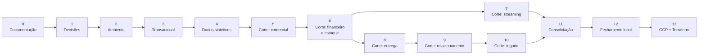

# Plano de Desenvolvimento

> **O que vive aqui:** a **sequência** de construção — etapas, marcos, dependências, critérios de
> conclusão e os conceitos exercitados em cada etapa.
>
> **O que não vive aqui:** *o que* será entregue e *por que* (ver
> [Termo de Abertura](../Abertura_de_projeto.md), entregas **E1–E12**); *como* o sistema é
> construído (ver [Arquitetura](arquitetura.md)); *quais escolhas* seguem abertas (ver
> [Registro de Decisões](adr/README.md)); os riscos e seus tratamentos (ver
> [Registro de Riscos](riscos.md)).

| Campo | Informação |
|---|---|
| Versão | 2.2 |
| Etapa atual | **Etapa 2 — Ambiente local reproduzível** (**M0** e **M1** concluídos) |
| Última revisão | 04/09/2026 |

---

## 1. Como este plano funciona

- O avanço é governado por **critérios de conclusão**, não por calendário. Não há datas: o projeto
  é conduzido por marcos, e o Owner pode acrescentar prazos quando fizer sentido.
- Cada etapa referencia as entregas do Termo pelo identificador (**E1–E12**), sem redescrevê-las.
- Uma etapa só termina quando **todos** os seus critérios estão satisfeitos e a *Definição de
  pronto* do [`CLAUDE.md`](../CLAUDE.md) foi aplicada.
- **O fator de escala `dev` é o padrão em todas as etapas.** O ambiente local é dimensionado por
  cobertura, não por volume ([ADR-0014](adr/0014-volume-por-proporcoes-e-fator-de-escala.md)): o que
  cada etapa precisa provar é que toda tabela, todo valor de enumeração e todo tipo de falha foram
  exercitados. O volume alto pertence à fase GCP.
- **Das Etapas 5 a 10, o trabalho avança em cortes verticais.** Cada corte atravessa todas as
  camadas: gerar, ingerir, transformar, testar, catalogar e consultar. Nenhum corte termina
  entregando uma camada isolada — é assim que o princípio **P1** deixa de ser retórica.
- **Governança e qualidade não são etapas finais.** A Etapa 11 *consolida* o que os cortes já
  produziram: cada corte atualiza dicionário, linhagem e testes na própria entrega (**P3**,
  risco **R4**).
- A partir da Etapa 2, o repositório permanece reproduzível do zero ao final de qualquer etapa.

---

## 2. Marcos

| Marco | Significado | Concluído em |
|---|---|---|
| **M0** | Termo de Abertura aprovado e documentação-base estável | Etapa 0 — **04/09/2026** |
| **M1** | Decisões fundamentais registradas em ADR | Etapa 1 — **04/09/2026** |
| **M2** | Ambiente local sobe do zero com um comando | Etapa 2 |
| **M3** | Primeiro fluxo completo origem → consumo | Etapa 5 |
| **M4** | Streaming em operação, com o *batch* intacto | Etapa 7 |
| **M5** | Fase local concluída, testada e reproduzível | Etapa 12 |
| **M6** | Fluxo replicado no GCP por Terraform | Etapa 13 |

---

## 3. Fundação

### Etapa 0 — Fundação documental e governança do repositório

*Concluída em 04/09/2026.*

| | |
|---|---|
| **Objetivo** | Estabelecer a documentação-base e as convenções, de modo que cada assunto tenha um único dono documental. |
| **Entregas** | **E1**, **E2** |
| **Artefatos** | Termo de Abertura, `README.md`, `CLAUDE.md` e os documentos de `docs/` |
| **Critérios de conclusão** | Termo revisado e aprovado pelo Owner ✓ (v1.2, 04/09/2026) · nenhuma consideração duplicada entre documentos ✓ · `.gitignore` revisado ✓ · ADR-0001 a ADR-0007 aceitos ✓ |
| **Riscos tratados** | **R1**, **R10** |
| **Conceitos** | Documentação como fonte única de verdade · registro de decisões · governança de projeto |

### Etapa 1 — Decisões técnicas fundamentais

| | |
|---|---|
| **Objetivo** | Fechar as escolhas que condicionam o código antes de escrever a primeira linha dele. |
| **Pré-requisito** | M0 |
| **Entregas** | **E2** |
| **Decisões** | **D02** ([ADR-0008](adr/0008-schemas-do-armazem.md)), **D03** ([ADR-0009](adr/0009-sqlalchemy-para-acesso-a-dados.md)), **D04** ([ADR-0010](adr/0010-alembic-para-migracoes.md)), **D09** ([ADR-0011](adr/0011-classificacao-e-papeis-de-acesso.md)) — todas aceitas em 03/09/2026 |
| **Critérios de conclusão** | Todas as decisões em estado `Aceita` ✓ · cada ADR declara o equivalente na fase GCP ✓ · nenhuma ferramenta escolhida sem problema declarado que a justifique ✓ · aprovação **A1** concedida em 04/09/2026, fechando **M0** ✓ |
| **Riscos tratados** | **R2**, **R3**, **R8** |
| **Conceitos** | *Trade-offs* de stack · decisão reversível contra irreversível · critério de paridade entre ambientes |

### Etapa 2 — Ambiente local reproduzível · **M2**

| | |
|---|---|
| **Objetivo** | Clonar o repositório e subir o ambiente com um comando. |
| **Pré-requisito** | M1 |
| **Entregas** | **E1**, **E11** (parcial) |
| **Decisões** | **D10** ([ADR-0012](adr/0012-repositorio-com-pacote-instalavel.md)) — aceita em 04/09/2026 |
| **Artefatos** | `docker/` com `source_db`, `legacy_db` e `warehouse_db` · `.env.example` · `Makefile` · ambiente Python com versões fixadas |
| **Critérios de conclusão** | Ambiente sobe do zero em máquina limpa · `make up`, `make down` e `make reset` conferidos · nenhum segredo versionado · dependências fixadas |
| **Riscos tratados** | **R6**, **R7**, **R11** |
| **Conceitos** | Contêineres e isolamento · configuração por variáveis de ambiente · fixação de dependências · operação por terminal |

### Etapa 3 — Modelo e banco transacional

| | |
|---|---|
| **Objetivo** | Um banco transacional que um sistema real poderia usar: normalizado, íntegro e versionado. |
| **Pré-requisito** | Etapa 2 |
| **Entregas** | **E3** |
| **Decisões** | **D13** ([ADR-0013](adr/0013-nomenclatura-por-prefixo-de-tipo.md)) — aceita em 04/09/2026 |
| **Artefatos** | Modelos SQLAlchemy das 40 tabelas em `src/` · `db/migrations/` geradas por Alembic a partir deles · diagrama entidade-relacionamento · dicionário preenchido para o schema `oltp` |
| **Critérios de conclusão** | Migrações aplicáveis do zero e reversíveis — a descida **executada**, não apenas gerada ([ADR-0010](adr/0010-alembic-para-migracoes.md)) · 3FN como referência, com desvios justificados por escrito · chaves, *constraints* e índices declarados · `inventory_movements` conforme o [contrato de evento](modelo_de_dados.md#5-contrato-do-evento-de-estoque) · todo campo classificado |
| **Riscos tratados** | **R4**, **R6** |
| **Conceitos** | Normalização · integridade referencial · *constraints* e índices · migração reversível · livro de eventos *append-only* |

### Etapa 4 — Gerador de dados sintéticos

| | |
|---|---|
| **Objetivo** | Gerar volume transacional realista, parametrizável e determinístico. |
| **Pré-requisito** | Etapa 3 |
| **Entregas** | **E4** |
| **Decisões** | **D26** ([ADR-0014](adr/0014-volume-por-proporcoes-e-fator-de-escala.md)) — aceita em 04/09/2026 |
| **Artefatos** | Motor em `src/generator/` · configuração declarativa das 40 tabelas com proporções, fator de escala e piso · `make size-report` |
| **Critérios de conclusão** | Mesma `seed` e mesma `as_of_date` produzem exatamente os mesmos dados · volume configurável sem alterar código · geração respeita todas as *constraints* e as [invariantes de negócio](modelo_de_dados.md#4-invariantes-de-negócio) · cobertura conferida por teste: toda tabela populada, todo valor de enumeração presente e toda invariante exercida · bytes por linha e tempo de geração **medidos** em fator 1 e registrados |
| **Riscos tratados** | **R5**, **R6**, **R11**, **R14** |
| **Conceitos** | Determinismo por semente · modelagem de distribuições · integridade referencial na geração · medição de capacidade |

---

## 4. Cortes verticais

Cada corte abaixo entrega **fluxo completo** para o seu domínio: geração → Airbyte → `raw` → dbt →
`staging` → `trusted` → `analytics` → view de consumo, com testes, catálogo e linhagem atualizados.

### Etapa 5 — Corte 1: núcleo comercial · **M3**

| | |
|---|---|
| **Objetivo** | Fechar o primeiro fluxo origem → consumo, ainda que estreito. |
| **Pré-requisito** | Etapa 4 |
| **Entregas** | **E5**, **E6**, **E7**, **E8**, **E10** (todas parciais) |
| **Escopo** | Clientes, catálogo, carrinhos e pedidos · `fact_sales_order_item` · `dim_customer`, `dim_product`, `dim_date`, `dim_sales_channel`, `dim_geography` |
| **Decisões** | **D20**, **D21** ([ADR-0015](adr/0015-sincronizacao-e-exclusoes.md)), **D23** ([ADR-0016](adr/0016-materializacao-por-camada.md)), **D25** ([ADR-0017](adr/0017-chaves-substitutas-e-scd.md)), **D24**, **D27** ([ADR-0018](adr/0018-fatos-e-views-a-partir-de-perguntas-de-negocio.md)) — todas aceitas em 04/09/2026 |
| **Artefatos** | Conexões Airbyte · projeto dbt com modelos, `.yml` e testes · DAG do Airflow · primeiras definições no [Glossário de Negócio](glossario_de_negocio/) |
| **Critérios de conclusão** | `make dbt-build` executa do zero e passa · grão de `fact_sales_order_item` declarado por escrito · contagens reconciliadas em todas as fronteiras · view de consumo responde a perguntas de negócio definidas · `dbt docs` mostra linhagem e glossário integrados |
| **Riscos tratados** | **R1**, **R3**, **R4** |
| **Conceitos** | Ingestão com controle de estado · camadas dbt · grão e esquema estrela · SCD tipo 2 · dimensão conformada · view como contrato · linhagem |

### Etapa 6 — Corte 2: financeiro e estoque em *batch*

| | |
|---|---|
| **Objetivo** | Acrescentar os processos que exigem reconciliação de valores e de saldos. |
| **Pré-requisito** | Etapa 5 |
| **Entregas** | **E6**, **E7**, **E10** (parciais) |
| **Escopo** | Pagamentos, transações, reembolsos, compras, recebimentos e movimentos de estoque · `fact_payment_transaction`, `fact_refund`, `fact_purchase_order_item`, `fact_inventory_movement` |
| **Critérios de conclusão** | Invariantes 2 a 8 do [modelo](modelo_de_dados.md#4-invariantes-de-negócio) com teste correspondente · reconciliação financeira fecha · saldo de estoque reconstruído a partir dos movimentos confere com `inventory_balances` · valores monetários em decimal, nunca `float` |
| **Riscos tratados** | **R5**, **R11** |
| **Conceitos** | Reconciliação financeira · precisão decimal · livro-razão de eventos · dimensão degenerada |

### Etapa 7 — Corte 3: streaming de estoque · **M4**

| | |
|---|---|
| **Objetivo** | Acrescentar o caminho quente sem alterar o caminho frio. |
| **Pré-requisito** | Etapa 6 — o *batch* precisa estar funcionando antes |
| **Entregas** | **E6**, **E10** (parciais) |
| **Decisões** | **D16**, **D17**, **D18** ([ADR-0019](adr/0019-saldo-em-deltas-com-entrega-idempotente.md)), **D29** ([ADR-0020](adr/0020-debezium-sobre-kafka-connect.md)) — todas aceitas em 04/09/2026 |
| **Artefatos** | Produtor em `src/streaming/` · conector Debezium · Redpanda no `docker/` · pipeline Beam · tabela de saldo em tempo real · view unificada · tópico de alerta |
| **Critérios de conclusão** | *Backfill* e streaming não duplicam linhas na fato · reprocessar o mesmo lote não altera o resultado · evento atrasado recalcula a janela e emite correção · transferência confere dos dois lados · alerta emitido ao cruzar o limiar · Airbyte deixa de ingerir incrementalmente `inventory_movements` |
| **Riscos tratados** | **R11**, **R13** |
| **Conceitos** | CDC sobre log de transações · tempo de evento · *watermarks* e *allowed lateness* · janelas e gatilhos · idempotência e deduplicação · *at least once* · caminho quente e frio sob o mesmo contrato |

### Etapa 8 — Corte 4: entrega e logística

| | |
|---|---|
| **Objetivo** | Modelar o ciclo pós-venda e os eventos de estado. |
| **Pré-requisito** | Etapa 6 |
| **Entregas** | **E6**, **E7**, **E10** (parciais) |
| **Escopo** | Remessas, itens de remessa, eventos de entrega e histórico de estado do pedido · `fact_shipment_item`, `fact_order_status_event` · `dim_carrier`, `dim_warehouse` |
| **Critérios de conclusão** | Transições de estado validadas · causalidade de datas testada · pedido dividido em mais de uma remessa tratado corretamente · prazo prometido e realizado definidos no glossário |
| **Conceitos** | Máquina de estados em dados · fato de evento de estado · causalidade temporal |

### Etapa 9 — Corte 5: relacionamento e histórico

| | |
|---|---|
| **Objetivo** | Fechar o modelo dimensional e exercitar o histórico de atributos. |
| **Pré-requisito** | Etapa 8 |
| **Entregas** | **E6**, **E7** (parciais) |
| **Escopo** | Campanhas, cupons, atendimento · `fact_coupon_redemption`, `fact_support_ticket_event` · dimensões restantes e cenários SCD |
| **Critérios de conclusão** | 9 fatos e 17 dimensões construídas · intervalos SCD tipo 2 sem sobreposição para a mesma chave natural · regras de elegibilidade de cupom testadas · glossário com churn e recompra definidos |
| **Conceitos** | SCD tipo 2 em profundidade · dimensões derivadas e conformadas · métricas de relacionamento |

### Etapa 10 — Corte 6: origem legada

| | |
|---|---|
| **Objetivo** | Exercitar a parte suja do trabalho: interpretar, corrigir, rejeitar e provar. |
| **Pré-requisito** | Etapa 9 |
| **Entregas** | **E5**, **E6**, **E10** (parciais) |
| **Decisões** | **D15** ([ADR-0021](adr/0021-procedencia-no-empilhamento.md)), **D28** ([ADR-0022](adr/0022-catalogo-declarativo-de-falhas-do-legado.md)) — aceitas em 04/09/2026 |
| **Artefatos** | `src/legacy/` com o gerador e o manifesto · `legacy_db` · *snapshot* em `raw_legacy` · schema `quarantine` · modelos de limpeza e empilhamento |
| **Critérios de conclusão** | `extraídos = aceitos + corrigidos + rejeitados` fecha exatamente · resultado confere com o manifesto, sem que a transformação o consulte · `raw_legacy` intacto · rejeitados preservados em quarentena com motivo · reprocessar o mesmo `snapshot_id` não duplica · nenhuma correção silenciosa |
| **Riscos tratados** | **R5**, **R14** |
| **Conceitos** | *Schema-on-read* × *schema-on-write* · dicionário de conversões determinísticas · quarentena em vez de descarte · procedência · teste contra oráculo |

---

## 5. Consolidação e nuvem

### Etapa 11 — Consolidação de governança e qualidade

| | |
|---|---|
| **Objetivo** | Auditar e fechar o que os cortes produziram de forma incremental. |
| **Pré-requisito** | Etapas 7 e 10 |
| **Entregas** | **E8**, **E9**, **E10** |
| **Decisões** | **D14** ([ADR-0023](adr/0023-escopo-do-schema-governance.md)) — aceita em 04/09/2026 |
| **Critérios de conclusão** | Nenhum campo sem classificação · linhagem completa e conferida contra o código · *roles* e *grants* implementados e **testados**: perfil de análise não alcança `raw`, `staging` nem `trusted` · retenção aplicável a cada objeto · suíte de testes executável por um comando, interrompendo o pipeline em caso de falha · reconciliação automática em todas as fronteiras |
| **Riscos tratados** | **R4**, **R7** |
| **Conceitos** | Catálogo e linhagem consolidados · controle de acesso por papel · retenção · suíte de qualidade e *fail fast* |

### Etapa 12 — Fechamento da fase local · **M5**

| | |
|---|---|
| **Objetivo** | Provar que o repositório entrega o que promete, do zero. |
| **Pré-requisito** | Etapa 11 |
| **Entregas** | **E11** |
| **Artefatos** | [Execução Local](execucao_local.md) completa e conferida · `make check` · pacote do [ponto de recuperação](capacidade_e_recuperacao.md#3-ponto-único-de-recuperação) · versão marcada no Git |
| **Critérios de conclusão** | Todos os critérios de sucesso do Termo verificados em ambiente limpo · execução completa com *batch* e *streaming* simultâneos, com tamanho e tempo medidos e registrados · cobertura integral conferida · restauração do ponto de recuperação testada, incluindo o *re-snapshot* do conector de CDC · documentação coerente com o código · nenhum segredo no repositório nem no histórico |
| **Riscos tratados** | **R6**, **R7**, **R10**, **R11** |
| **Conceitos** | Reprodutibilidade verificada · versionamento semântico · recuperação testada · auditoria de entrega |

### Etapa 13 — Replicação no GCP com Terraform · **M6**

| | |
|---|---|
| **Objetivo** | Levar o fluxo para a nuvem preservando o desenho conceitual. |
| **Pré-requisito** | M5 e autorização explícita do Owner |
| **Entregas** | **E12** |
| **Decisões** | **D11**, **D22** ([ADR-0024](adr/0024-airbyte-e-airflow-no-gcp.md)), **Q1** ([ADR-0025](adr/0025-policy-tags-por-fluxo-automatizado.md)) — aceitas em 04/09/2026 |
| **Artefatos** | `terraform/` provisionando Cloud SQL, BigQuery, IAM, contas de serviço, redes, Datastream, Pub/Sub, Dataflow e *policy tags* · dbt adaptado de dialeto · publicação dos metadados no Dataplex · estimativa de custo por serviço |
| **Critérios de conclusão** | Todo item do [mapa de paridade](arquitetura.md#5-mapa-de-paridade-local--gcp) com equivalente provisionado · `terraform plan` revisado antes de cada `apply` · particionamento, *clustering*, retenção e políticas definidos antes do provisionamento · *policy tag* aplicada a cada coluna sensível pelo fluxo automatizado do [ADR-0025](adr/0025-policy-tags-por-fluxo-automatizado.md), com acesso negado comprovado e sem credencial longeva · Composer e Airbyte criados e **destruídos** na mesma janela, com custo estimado e real registrados · paridade funcional com a fase local demonstrada |
| **Riscos tratados** | **R3**, **R9** |
| **Conceitos** | Infraestrutura como código · IAM e *policy tags* · particionamento e *clustering* no BigQuery · portabilidade de pipeline · estimativa de custo |

---

## 6. Fora deste plano

Operação continuada na nuvem, BI e dashboards finais, novas fontes externas e CI/CD de
infraestrutura não fazem parte deste plano. Qualquer um deles passa pela seção *Gestão de
Mudanças* do [Termo de Abertura](../Abertura_de_projeto.md).
