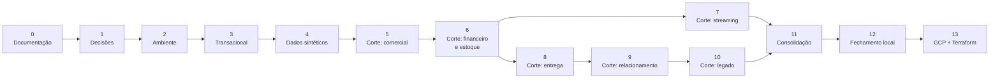

# Plano de Desenvolvimento

> **O que vive aqui:** a **sequência** de construção — etapas, marcos, dependências, critérios de
> conclusão e os conceitos exercitados em cada etapa.
>
> **O que não vive aqui:** *o que* será entregue e *por que* (ver
> [Termo de Abertura](../Abertura_de_projeto.md), entregas **E1–E12**); *como* o sistema é
> construído (ver [Arquitetura](arquitetura.md)); *quais escolhas* seguem abertas (ver
> [Registro de Decisões](adr/README.md)); os riscos e seus tratamentos (ver
> [Registro de Riscos](riscos.md)).

| Campo | Informação |
|---|---|
| Versão | 3.6 |
| Etapa atual | **Etapa 12 — Fechamento da fase local**: os seis critérios medidos em 25/09/2026, num ciclo do zero, e a definição de pronto aplicada; aguarda a revisão final e o aceite do Owner, que fecham o **M5** (**M0** a **M4** concluídos) |
| Última revisão | 25/09/2026 (Etapa 12 fechada, aguardando a revisão final e o aceite) |

---

## 1. Como este plano funciona

- O avanço é governado por **critérios de conclusão**, não por calendário. Não há datas: o projeto
  é conduzido por marcos, e o Owner pode acrescentar prazos quando fizer sentido.
- Cada etapa referencia as entregas do Termo pelo identificador (**E1–E12**), sem redescrevê-las.
- Uma etapa só termina quando **todos** os seus critérios estão satisfeitos e a *Definição de
  pronto* do [`CLAUDE.md`](../CLAUDE.md) foi aplicada.
- **O fator de escala `dev` é o padrão em todas as etapas.** O ambiente local é dimensionado por
  cobertura, não por volume ([ADR-0014](adr/0014-volume-por-proporcoes-e-fator-de-escala.md)): o que
  cada etapa precisa provar é que toda tabela, todo valor de enumeração e todo tipo de falha foram
  exercitados. O volume alto pertence à fase GCP.
- **Das Etapas 5 a 10, o trabalho avança em cortes verticais.** Cada corte atravessa todas as
  camadas: gerar, ingerir, transformar, testar, catalogar e consultar. Nenhum corte termina
  entregando uma camada isolada — é assim que o princípio **P1** deixa de ser retórica.
- **Governança e qualidade não são etapas finais.** A Etapa 11 *consolida* o que os cortes já
  produziram: cada corte atualiza dicionário, linhagem e testes na própria entrega (**P3**,
  risco **R4**).
- A partir da Etapa 2, o repositório permanece reproduzível do zero ao final de qualquer etapa.

---

## 2. Marcos

| Marco | Significado | Concluído em |
|---|---|---|
| **M0** | Termo de Abertura aprovado e documentação-base estável | Etapa 0 — **04/09/2026** |
| **M1** | Decisões fundamentais registradas em ADR | Etapa 1 — **04/09/2026** |
| **M2** | Ambiente local sobe do zero com um comando | Etapa 2 — **04/09/2026** |
| **M3** | Primeiro fluxo completo origem → consumo | Etapa 5 — **04/09/2026** |
| **M4** | Streaming em operação, com o *batch* intacto | Etapa 7 — **04/09/2026** |
| **M5** | Fase local concluída, testada e reproduzível | Etapa 12 |
| **M6** | Fluxo replicado no GCP por Terraform | Etapa 13 |

---

## 3. Fundação

### Etapa 0 — Fundação documental e governança do repositório

*Concluída em 04/09/2026.*

| | |
|---|---|
| **Objetivo** | Estabelecer a documentação-base e as convenções, de modo que cada assunto tenha um único dono documental. |
| **Entregas** | **E1**, **E2** |
| **Artefatos** | Termo de Abertura, `README.md`, `CLAUDE.md` e os documentos de `docs/` |
| **Critérios de conclusão** | Termo revisado e aprovado pelo Owner ✓ (v1.2, 04/09/2026) · nenhuma consideração duplicada entre documentos ✓ · `.gitignore` revisado ✓ · ADR-0001 a ADR-0007 aceitos ✓ |
| **Riscos tratados** | **R1**, **R10** |
| **Conceitos** | Documentação como fonte única de verdade · registro de decisões · governança de projeto |

### Etapa 1 — Decisões técnicas fundamentais

| | |
|---|---|
| **Objetivo** | Fechar as escolhas que condicionam o código antes de escrever a primeira linha dele. |
| **Pré-requisito** | M0 |
| **Entregas** | **E2** |
| **Decisões** | **D02** ([ADR-0008](adr/0008-schemas-do-armazem.md)), **D03** ([ADR-0009](adr/0009-sqlalchemy-para-acesso-a-dados.md)), **D04** ([ADR-0010](adr/0010-alembic-para-migracoes.md)), **D09** ([ADR-0011](adr/0011-classificacao-e-papeis-de-acesso.md)) — todas aceitas em 03/09/2026 |
| **Critérios de conclusão** | Todas as decisões em estado `Aceita` ✓ · cada ADR declara o equivalente na fase GCP ✓ · nenhuma ferramenta escolhida sem problema declarado que a justifique ✓ · aprovação **A1** concedida em 04/09/2026, fechando **M0** ✓ |
| **Riscos tratados** | **R2**, **R3**, **R8** |
| **Conceitos** | *Trade-offs* de stack · decisão reversível contra irreversível · critério de paridade entre ambientes |

### Etapa 2 — Ambiente local reproduzível · **M2**

*Concluída em 04/09/2026.*

| | |
|---|---|
| **Objetivo** | Clonar o repositório e subir o ambiente com um comando. |
| **Pré-requisito** | M1 |
| **Entregas** | **E1**, **E11** (parcial) |
| **Decisões** | **D10** ([ADR-0012](adr/0012-repositorio-com-pacote-instalavel.md)) · ambiente Python ([ADR-0026](adr/0026-uv-para-ambiente-e-dependencias.md)) — aceitas em 04/09/2026 |
| **Artefatos** | `docker/docker-compose.yml` com `source_db`, `legacy_db` e `warehouse_db` · `.env.example` · `Makefile` · `pyproject.toml`, `uv.lock` e `.python-version` |
| **Critérios de conclusão** | Ambiente sobe do zero em máquina limpa ✓ · `make up`, `make down` e `make reset` conferidos ✓ · nenhum segredo versionado ✓ · dependências fixadas ✓ (imagem por *digest*, interpretador em série fechada, `uv.lock` versionado) |
| **Riscos tratados** | **R6**, **R7**, **R11** |
| **Conceitos** | Contêineres e isolamento · configuração por variáveis de ambiente · fixação de dependências · operação por terminal |

### Etapa 3 — Modelo e banco transacional

*Concluída em 04/09/2026.*

| | |
|---|---|
| **Objetivo** | Um banco transacional que um sistema real poderia usar: normalizado, íntegro e versionado. |
| **Pré-requisito** | Etapa 2 |
| **Entregas** | **E3** |
| **Decisões** | **D13** ([ADR-0013](adr/0013-nomenclatura-por-prefixo-de-tipo.md)) — aceita em 04/09/2026 |
| **Artefatos** | Modelos SQLAlchemy das 40 tabelas em `src/mvp_ed1/models/` · `db/migrations/` derivadas deles · diagrama ER e dicionário **gerados** dos modelos por `make catalog` |
| **Critérios de conclusão** | Migrações aplicáveis do zero e reversíveis — descida **executada** ✓ (subida → descida → subida, 40 tabelas → 0 → 40) · 3FN como referência, com [seis desvios justificados](modelo_de_dados.md) ✓ · chaves, *constraints* e índices declarados ✓ (59 índices, `CHECK` em toda enumeração) · `inventory_movements` conforme o [contrato de evento](modelo_de_dados.md#5-contrato-do-evento-de-estoque) ✓ · todo campo classificado ✓ (418 campos, conferido por asserção) |
| **Riscos tratados** | **R4**, **R6** |
| **Conceitos** | Normalização · integridade referencial · *constraints* e índices · migração reversível · livro de eventos *append-only* |

### Etapa 4 — Gerador de dados sintéticos

*Concluída em 04/09/2026.*

| | |
|---|---|
| **Objetivo** | Gerar volume transacional realista, parametrizável e determinístico. |
| **Pré-requisito** | Etapa 3 |
| **Entregas** | **E4** |
| **Decisões** | **D26** ([ADR-0014](adr/0014-volume-por-proporcoes-e-fator-de-escala.md)) · formato e piso da configuração ([ADR-0027](adr/0027-configuracao-do-gerador-em-yaml.md)) — aceitas em 04/09/2026 |
| **Artefatos** | Motor em `src/mvp_ed1/generator/` com nove construtores de domínio · configuração declarativa das 40 tabelas em `geracao.yml` · `make seed-data`, `make seed-plan`, `make size-report` e `make test` · 56 testes em `tests/` |
| **Critérios de conclusão** | Mesma `seed` e mesma `as_of_date` produzem exatamente os mesmos dados ✓ (comparado por impressão digital do conjunto) · volume configurável sem alterar código ✓ (`SCALE`, `SEED` e `AS_OF` no alvo; a seção 2 do [Modelo de Dados](modelo_de_dados.md) passou a ser **gerada** da configuração) · geração respeita todas as *constraints* e as [invariantes de negócio](modelo_de_dados.md#4-invariantes-de-negócio) ✓ (carga por `COPY` conferida pelo banco; as doze invariantes verificadas em SQL e em `pytest`) · cobertura conferida por teste ✓ (40 tabelas populadas e todo valor de enumeração presente, também no fator 0,05) · bytes por linha e tempo **medidos** em fator 1 e registrados ✓ ([Capacidade §2.1](capacidade_e_recuperacao.md#21-medido-na-etapa-4--origem-transacional)) |
| **Riscos tratados** | **R5**, **R6**, **R11**, **R14** |
| **Conceitos** | Determinismo por semente · modelagem de distribuições · integridade referencial na geração · medição de capacidade |

---

## 4. Cortes verticais

Cada corte abaixo entrega **fluxo completo** para o seu domínio: geração → Airbyte → `raw` → dbt →
`staging` → `trusted` → `analytics` → view de consumo, com testes, catálogo e linhagem atualizados.

**Revalidação transversal da D31 — 05/09/2026.** O gerador foi corrigido (`522a8fc`), a manutenção
do estado do streaming passou a conferir seu resultado (`04a824a`) e o teste dbt virou bloqueante
(`e5ff5ca`). Origem e caminhos frio/quente foram reconstruídos; testes Python e dbt, reconciliação
por conteúdo, duplicatas, alertas, comparação incremental/completo e a DAG foram reexecutados.
Resultados nos donos documentais: [Qualidade](qualidade_de_dados.md),
[Streaming §7.2](streaming.md#72-revalidação-da-d31) e
[Capacidade §2.7](capacidade_e_recuperacao.md#27-re-medição-da-d31--05092026).
As tabelas das etapas abaixo preservam seus cortes históricos; não são a medição pós-D31.
O [aceite do Owner](pendencias.md#d31--encerrada) foi registrado em 05/09/2026, antes
do encerramento formal. A Etapa 10 não foi iniciada nesta revalidação.

### Etapa 5 — Corte 1: núcleo comercial · **M3**

*Concluída em 04/09/2026.*

| | |
|---|---|
| **Objetivo** | Fechar o primeiro fluxo origem → consumo, ainda que estreito. |
| **Pré-requisito** | Etapa 4 |
| **Entregas** | **E5**, **E6**, **E7**, **E8**, **E10** (todas parciais) |
| **Escopo** | Clientes, catálogo, carrinhos e pedidos · `fact_sales_order_item` e `fact_cart_event` · `dim_customer`, `dim_product`, `dim_date`, `dim_sales_channel`, `dim_geography` |
| **Decisões** | **D20**, **D21** ([ADR-0015](adr/0015-sincronizacao-e-exclusoes.md)), **D23** ([ADR-0016](adr/0016-materializacao-por-camada.md)), **D25** ([ADR-0017](adr/0017-chaves-substitutas-e-scd.md)), **D24**, **D27** ([ADR-0018](adr/0018-fatos-e-views-a-partir-de-perguntas-de-negocio.md)) — aceitas em 04/09/2026 · a fato de carrinho ([ADR-0028](adr/0028-fato-de-carrinho-para-o-funil.md)) · **D30** ([ADR-0029](adr/0029-exclusao-logica-como-marca-na-dimensao.md)) |
| **Artefatos** | Conexões Airbyte declaradas em Terraform sobre `airbyte/streams.yml` · projeto dbt com 36 modelos, 2 *snapshots*, 1 *seed* e 166 objetos no `build` · DAG do caminho frio com uma tarefa por camada · 16 perguntas e 6 conceitos no [Glossário de Negócio](glossario_de_negocio/) |
| **Critérios de conclusão** | `make dbt-build` executa do zero e passa ✓ (166 objetos, 0 erros) · grão de `fact_sales_order_item` declarado por escrito ✓ (e provado por `unique` sobre a chave do grão) · contagens reconciliadas em todas as fronteiras ✓ (`oltp` → `raw` → `staging` → fato, exatas) · view de consumo responde a perguntas de negócio definidas ✓ (P01 a P07, com `contract: enforced`) · `dbt docs` mostra linhagem e glossário integrados ✓ (36 modelos, 127 testes e os 6 conceitos do glossário no manifesto) · **fluxo executado ponta a ponta pelo orquestrador** ✓ (oito tarefas verdes em 2 min 53 s) |
| **Riscos tratados** | **R1**, **R3**, **R4** |
| **Conceitos** | Ingestão com controle de estado · camadas dbt · grão e esquema estrela · SCD tipo 2 · dimensão conformada · view como contrato · linhagem |

### Etapa 6 — Corte 2: financeiro e estoque em *batch*

*Concluída em 04/09/2026.*

| | |
|---|---|
| **Objetivo** | Acrescentar os processos que exigem reconciliação de valores e de saldos. |
| **Pré-requisito** | Etapa 5 |
| **Entregas** | **E6**, **E7**, **E10** (parciais) |
| **Escopo** | Pagamentos, transações, reembolsos, compras, recebimentos e movimentos de estoque · `fact_payment_transaction`, `fact_refund`, `fact_purchase_order_item`, `fact_inventory_movement` |
| **Decisões** | Origem do custo do produto vendido ([ADR-0030](adr/0030-cmv-do-livro-de-estoque.md)) — aceita em 04/09/2026 |
| **Artefatos** | 15 fluxos novos no `airbyte/streams.yml`, com os **três** modos do ADR-0015 exercitados · 25 modelos de `staging` · 3 dimensões e 4 fatos novas · views P08 a P11 com contrato · 8 testes singulares para as invariantes que atravessam linhas |
| **Critérios de conclusão** | Invariantes 2 a 8 com teste correspondente ✓ (uma por arquivo em `dbt/tests/`, com o motivo escrito de por que não são `CHECK`) · reconciliação financeira fecha ✓ (captura ≤ autorização e reembolso ≤ captura, zero violações) · saldo reconstruído dos movimentos confere com `inventory_balances` ✓ (**zero divergências** em 2.910 pares) · valores monetários em decimal ✓ (**zero colunas `float`** nas três camadas do armazém) |
| **Riscos tratados** | **R5**, **R11** |
| **Conceitos** | Reconciliação financeira · precisão decimal · livro-razão de eventos · dimensão degenerada |

### Etapa 7 — Corte 3: streaming de estoque · **M4**

*Concluída em 04/09/2026.*

| | |
|---|---|
| **Objetivo** | Acrescentar o caminho quente sem alterar o caminho frio. |
| **Pré-requisito** | Etapa 6 — o *batch* precisa estar funcionando antes |
| **Entregas** | **E6**, **E10** (parciais) |
| **Decisões** | **D16**, **D17**, **D18** ([ADR-0019](adr/0019-saldo-em-deltas-com-entrega-idempotente.md)), **D29** ([ADR-0020](adr/0020-debezium-sobre-kafka-connect.md)) · aterrissagem e reconciliação ([ADR-0031](adr/0031-aterrissagem-do-caminho-quente-em-raw.md)) · ponta de leitura ([ADR-0032](adr/0032-fonte-python-no-lugar-do-kafkaio.md)) |
| **Artefatos** | `streaming/fluxo.yml` e `streaming/connectors/` · `docker/docker-compose.streaming.yml` com Redpanda e Kafka Connect · `src/mvp_ed1/streaming/` — produtor, transporte, pipeline Beam e destino · `raw.inventory_movements_stream` · view `skus_below_reorder_point` (**P12**) · tópico `mvp.alerts.inventory_low_stock` |
| **Critérios de conclusão** | *Backfill* e streaming não duplicam linhas na fato ✓ (15.446 distintos, 15.446 na fato, sobreposição total) · reprocessar o mesmo lote não altera o resultado ✓ (250 duplicatas injetadas, 0 gravadas) · evento atrasado recalcula a janela e emite correção ✓ (2 correções emitidas) · transferência confere dos dois lados ✓ (`transferencia_confere_dos_dois_lados`) · alerta emitido ao cruzar o limiar ✓ (10 aberturas, 20 normalizações) · Airbyte deixa de ingerir incrementalmente `inventory_movements` ✓ (passou a `full_refresh`, e virou a área de reconciliação) |
| **Riscos tratados** | **R11**, **R13** |
| **Conceitos** | CDC sobre log de transações · tempo de evento · *watermarks* e *allowed lateness* · janelas e gatilhos · idempotência e deduplicação · *at least once* · caminho quente e frio sob o mesmo contrato |

### Etapa 8 — Corte 4: entrega e logística

*Concluída em 05/09/2026.*

| | |
|---|---|
| **Objetivo** | Modelar o ciclo pós-venda e os eventos de estado. |
| **Pré-requisito** | Etapa 6 |
| **Entregas** | **E6**, **E7**, **E10** (parciais) |
| **Decisões** | Grão da medição de entrega ([ADR-0033](adr/0033-entrega-medida-em-dois-graos.md)) · procedência da data realizada ([ADR-0034](adr/0034-entrega-do-livro-de-eventos.md)) |
| **Escopo** | Remessas, itens de remessa, eventos de entrega e histórico de estado do pedido · `fact_shipment_item`, `fact_order_status_event` · `dim_carrier`, `dim_warehouse` |
| **Artefatos** | Três fluxos de ingestão novos — `carriers`, `delivery_events`, `order_status_history` · cinco modelos em `trusted` · `dim_carrier`, `fact_shipment_item` (7.329 linhas), `fact_order_status_event` (15.694) · views `on_time_delivery_rate_by_carrier` e `order_to_delivery_time_by_region` · *seed* `order_status_transitions` · schema `quarantine` com o primeiro morador |
| **Critérios de conclusão** | Transições de estado validadas ✓ (9 pares observados, 9 declarados na *seed*, e um `pytest` confere a *seed* contra os caminhos do gerador) · causalidade de datas testada ✓ (invariante 10, seis elos, 0 violações) · pedido dividido em mais de uma remessa tratado corretamente ✓ (637 pedidos divididos; o ciclo nunca é menor que a chegada de qualquer remessa do pedido) · prazo prometido e realizado definidos no glossário ✓ ([entrega no prazo](glossario_de_negocio/entrega_no_prazo.md) na remessa, [ciclo de entrega](glossario_de_negocio/ciclo_de_entrega.md) no pedido) |
| **Conceitos** | Máquina de estados em dados · fato de evento de estado · causalidade temporal · papéis de data na mesma dimensão · regra em artefato declarativo · quarentena como destino |

### Etapa 9 — Corte 5: relacionamento e histórico

*Concluída em 05/09/2026.*

| | |
|---|---|
| **Objetivo** | Fechar o modelo dimensional e exercitar o histórico de atributos. |
| **Pré-requisito** | Etapa 8 |
| **Entregas** | **E6**, **E7** (parciais) |
| **Decisões** | Escopo do inventário dimensional ([ADR-0035](adr/0035-aposentar-dimensoes-sem-pergunta.md)) · âncora da janela de P16 ([ADR-0036](adr/0036-recompra-ancorada-no-pedido.md)) |
| **Escopo** | Campanhas, cupons, atendimento · `fact_coupon_redemption`, `fact_support_ticket_event` · dimensões restantes e cenários SCD |
| **Artefatos** | Seis fluxos de ingestão novos · seis modelos em `trusted` · `dim_campaign`, `dim_coupon`, `dim_support_agent`, `dim_support_category` · `fact_coupon_redemption` (600 linhas), `fact_support_ticket_event` (1.723) · *snapshots* `scd_coupon` e `scd_support_agent` · views `support_tickets_per_hundred_orders` e `repeat_purchase_rate_after_support` · *seed* `support_categories` |
| **Critérios de conclusão** | 10 fatos e 15 dimensões construídas ✓ ([ADR-0035](adr/0035-aposentar-dimensoes-sem-pergunta.md)) · intervalos SCD tipo 2 sem sobreposição ✓ (quatro dimensões historizadas, `vigencias_sem_sobreposicao` em todas) · regras de elegibilidade de cupom testadas ✓ (invariante 12, quatro condições, 0 violações em 600 resgates) · glossário com churn e recompra pós-pedido definidos ✓ ([churn](glossario_de_negocio/churn.md), [recompra pós-pedido](glossario_de_negocio/recompra_pos_pedido.md), [ADR-0036](adr/0036-recompra-ancorada-no-pedido.md)) |
| **Conceitos** | SCD tipo 2 em profundidade · dimensões derivadas e conformadas · métricas de relacionamento · *drill across* entre fatos de grãos diferentes · coorte de cliente contra coorte de evento |

### Etapa 10 — Corte 6: origem legada

*Reaberta em 07/09/2026 e **aceita pelo Owner em 17/09/2026**, depois de sete rodadas de revisão
por outro agente (a sétima sem achados), sob uma condição — o bloco de sincronizações da
[D44](pendencias.md#d44--decidida-em-16092026-implementada-e-medida-em-17092026): diário de mutações
refeito no formato novo e a troca de representação da chave provada entre duas capturas certificadas
reais — **executada e medida no mesmo dia** (capturas 38 e 39; os números estão na D44). O revisor deixou
fora da medição dele o `make dbt-build` completo (o `PASS=891` abaixo é medição do autor) e o custo
da macro de canonização; o Owner aceitou com essas ressalvas registradas.* Foi declarada concluída
em 06/09, e a revisão por outro agente mostrou que não estava: **doze achados bloqueantes**, entre eles duas ausências de
escopo — o empilhamento em `trusted` não existia (tratado em 07/09), e o schema legado estava fora
do ciclo de migrações (tratado em 14/09). Os critérios abaixo trazem ✓ **só** onde há medição, com a
captura e a versão em que foi feita.

O erro de processo vale registrado: encerrei a etapa com base nos testes que **eu** havia escrito.
Teste que o próprio autor desenha mede o que ele pensou em medir.

| | |
|---|---|
| **Objetivo** | Exercitar a parte suja do trabalho: interpretar, corrigir, rejeitar e provar. |
| **Pré-requisito** | Etapa 9 |
| **Entregas** | **E5**, **E6**, **E10** (parciais) |
| **Decisões** | **D15** ([ADR-0021](adr/0021-procedencia-no-empilhamento.md)), **D28** ([ADR-0022](adr/0022-catalogo-declarativo-de-falhas-do-legado.md)) — aceitas em 04/09/2026 · retenção das capturas ([ADR-0037](adr/0037-reter-capturas-do-legado-por-acrescimo.md)) · duplicata e cascata ([ADR-0038](adr/0038-quarentena-de-excedente-e-rejeicao-em-cascata.md)) · alcance da procedência ([ADR-0039](adr/0039-alcance-da-procedencia.md)) — aceitas em 05/09/2026 |
| **Artefatos** | `src/mvp_ed1/legacy/` com o catálogo declarativo, o gerador e o manifesto · `legacy_db` · *snapshot* em `raw_legacy` · schema `quarantine` · modelos de limpeza e empilhamento |
| **Critérios de conclusão** | `extraídos = aceitos + corrigidos + rejeitados` fecha exatamente ✓ na captura selecionada e `empilhados = aceitos + corrigidos` na fronteira do empilhamento ✓ (testes de dados a cada *build*; `PASS=891` em 15/09/2026, captura 36, v8) · resultado confere com o manifesto ✓ **por ocorrência, para o lote inteiro** — 12.747 vereditos, achados de contexto e cascata incluídos, 44 valores recuperados conforme o contrato (15/09/2026, **captura 28**, e de novo em 17/09/2026 na **captura 38**, o lote íntegro recarregado, v9; as capturas 29–36 e 39 são lotes mutados e provam remoção, inclusão, reaparecimento e troca de representação, não a comparação integral) · `raw_legacy` intacto ✓ e cada captura **certificada por conteúdo** (oito certificadas, uma recusada de propósito com 39/40 tabelas) · duas capturas certificadas distinguem remoção real de falha de ingestão ✓ (5 clientes e 3 movimentos removidos, detectados e persistidos; captura incompleta não comparada) · rejeitados preservados em quarentena com motivo ✓, e tratamento alterado sob o mesmo rótulo **recusado** com as duas auditorias retidas (ciclo D34 em cópia isolada, 15/09) · reprocessar o mesmo `snapshot_id` não duplica ✓ (reconstrução como captura 28 depois de 35: `PASS=696` nas duas) · nenhuma correção silenciosa ✓ — toda correção tem valor esperado declarado no catálogo e conferido (R04, R05 e R07 fechados em 08/09) |
| **Riscos tratados** | **R5**, **R14** |
| **Conceitos** | *Schema-on-read* × *schema-on-write* · dicionário de conversões determinísticas · quarentena em vez de descarte · procedência · teste contra oráculo |

---

## 5. Consolidação e nuvem

### Etapa 11 — Consolidação de governança e qualidade

*Os seis critérios abaixo foram satisfeitos entre 17 e 18/09/2026, cada um com a sua medição, e a
[definição de pronto](../CLAUDE.md#7-definição-de-pronto) foi aplicada em 18/09/2026: migrações do
zero nos três bancos (origem por `make test-carga`, legado com as 40 tabelas, armazém por
`governance.garantir()`), DAG `fluxo_batch` de ponta a ponta (13 tarefas `success` em 7 min 58 s,
captura 43 certificada, tarefa nova `dbt_fronteiras` com os 14 testes de fronteira — sem ela, a
seleção indireta do dbt os executava na tarefa da primeira camada que citam), `make check` verde e
revisão de segredos. Nenhum componente novo, logo nenhum ADR novo: a etapa implementou decisões já
tomadas — ADR-0011 (papéis), ADR-0023 (governança), ADR-0031 (aterrissagem), ADR-0044
(certificado). **Aceita pelo Owner em 18/09/2026**, depois de três rodadas de revisão por outro
agente no mesmo dia — sete achados, todos aplicados e confirmados; o registro está nas
[pendências](pendencias.md#11-decididas-e-implementadas).*

| | |
|---|---|
| **Objetivo** | Auditar e fechar o que os cortes produziram de forma incremental. |
| **Pré-requisito** | Etapas 7 e 10 |
| **Entregas** | **E8**, **E9**, **E10** |
| **Decisões** | **D14** ([ADR-0023](adr/0023-escopo-do-schema-governance.md)) — aceita em 04/09/2026 |
| **Critérios de conclusão** | Nenhum campo sem classificação ✓ (17/09/2026: de 738 para **4.161 de 4.161** colunas nas nove camadas, classificação derivada dos modelos SQLAlchemy por linhagem — [Governança §5.1](governanca_de_dados.md#51-padrão-de-metadados); `tests/test_classificacao.py` com todos os pisos em 100 e `make check` acusando `.yml` atrasado) · linhagem completa e conferida contra o código ✓ (18/09/2026: por coluna, do SQL compilado — **2.983 de 2.983** colunas dos modelos, em 199 relações, fecham numa fonte, seed ou coluna gerada, 0 sem resolver; as travessias fora do dbt lidas de `airbyte/streams.yml`, `streaming/fluxo.yml` e da DAG; pontes do legado declaram `meta.lineage` e o maior conjunto de origens no consumo cai de 423 para 12 colunas; [Dicionário §3](dicionario_de_dados.md#3-linhagem) gerado por `make catalog`, conferido por `make check` e `tests/test_linhagem.py`) · *roles* e *grants* implementados e **testados**: perfil de análise não alcança `raw`, `staging` nem `trusted` ✓ (18/09/2026: cinco papéis sem login criados por `governance.garantir()`, concessão declarada por camada — `+grants`, `meta.grants`, `meta.writers` — e aplicada pelo dbt e pelo `on-run-end`; `tests/test_acesso.py` assume cada papel e executa leitura em 278 objetos (1.390 leituras), escrita em cada schema e `insert` na aterrissagem: `analyst` lê as 16 views de `consumption` e nada mais — [Governança §7](governanca_de_dados.md#7-regras-de-acesso-por-camada)) · retenção aplicável a cada objeto ✓ (17/09/2026: `meta.retention` por camada e por fonte, 9 camadas cobertas, `tests/test_retencao.py` contra a Governança §8) · suíte de testes executável por um comando, interrompendo o pipeline em caso de falha ✓ (`make check`, 17/09/2026: segredos → `dbt build` `PASS=892` → `pytest` 254 passed, 4 min 27 s; contraprova: segredo em arquivo rastreado para a execução na primeira etapa) · reconciliação automática em todas as fronteiras ✓ (18/09/2026: as oito fronteiras da [Qualidade §7](qualidade_de_dados.md#7-reconciliação-entre-camadas) com teste nomeado e executado por `make check` — três novos nesse dia: `tests/test_reconciliacao_raw.py` para `oltp → raw` (36 tabelas, identidades no instante da extração, 96 lotes identificados), `retail_empilhado_reconcilia` gerado para as 27 condutoras e `saldo_da_view_confere_com_o_livro_distinto` para a composição quente + frio; mais `fato_reconcilia_com_a_condutora` declarado nas 10 fatos para `trusted → analytics`; o fechamento acusou seis saldos em `raw` e 2.200 movimentos no livro do caminho quente que a origem já não tinha — resto de uma regeneração sem o procedimento da [Execução Local §3.2](execucao_local.md#32-regerar-uma-origem-que-já-alimenta-streaming), executado no mesmo dia: `make check` verde, `PASS=905`, 283 testes Python) |
| **Riscos tratados** | **R4**, **R7** |
| **Conceitos** | Catálogo e linhagem consolidados · controle de acesso por papel · retenção · suíte de qualidade e *fail fast* |

### Etapa 12 — Fechamento da fase local · **M5**

*Os seis critérios abaixo foram medidos em 25/09/2026, num ciclo do zero, e a
[definição de pronto](../CLAUDE.md#7-definição-de-pronto) foi aplicada no mesmo dia: migrações do
zero nos três bancos, o fluxo de ponta a ponta pela DAG e pelo *streaming*, `make check` verde, a
reconciliação entre as camadas e entre os dois caminhos do estoque, catálogo e linhagem em dia
(`make catalog` não escreveu nada), nenhum campo novo — a etapa não tocou modelo — e a revisão de
segredos no repositório e no histórico. O ciclo achou oito desvios, cada um corrigido na origem e a
linha refeita; quatro só aparecem num ambiente novo, porque no *checkout* antigo tudo já existia.
Nenhum componente novo, logo nenhum ADR novo: as decisões da etapa, D45 a D61, são de operação ou
consequência de ADRs aceitos — nenhuma troca ferramenta, camada ou modelagem — e estão nas
[pendências](pendencias.md#2-decisões-já-fechadas), com a pergunta sobre a §9 da Governança que fica
para o aceite; o [ADR-0044](adr/0044-certificar-cada-captura-do-legado-por-conteudo.md) recebeu nas
*Consequências* a guarda da identidade e o re-base das gerações. **Aguarda a revisão final por outro agente e o
aceite do Owner**; a *tag* `v1.0.0` (D47) marca o *commit* de fechamento.*

| | |
|---|---|
| **Objetivo** | Provar que o repositório entrega o que promete, do zero. |
| **Pré-requisito** | Etapa 11 |
| **Entregas** | **E11** |
| **Artefatos** | [Execução Local](execucao_local.md) completa e conferida · `make check` · pacote do [ponto de recuperação](capacidade_e_recuperacao.md#3-ponto-único-de-recuperação) · versão marcada no Git |
| **Critérios de conclusão** | Todos os critérios de sucesso do Termo verificados em ambiente limpo ✓ (25/09/2026: clone novo, com `.env` novo, depois de desmontadas as três composições e o *cluster* do Airbyte — a opção (a) da D45; cada critério do [Termo §6](../Abertura_de_projeto.md#6-critérios-de-sucesso) com a saída de um comando: as 13 tarefas da DAG `success`, as 16 views consultadas por `tests/test_consumo.py`, o catálogo servido com `200`, `(head)` nas migrações das duas origens e as duas versões do armazém, `make check` verde com `PASS=905` e 579 testes Python, os 14 testes de fronteira, `sensitivity --check` e `lineage --check`; a máquina que nunca viu o projeto fica para a fase seguinte, pela D45) · execução completa de **cada cenário no seu subconjunto de ambiente** ([Execução Local §5](execucao_local.md#5-executando-por-partes)), com tamanho, tempo e pico de memória medidos e registrados — sem *batch* e *streaming* simultâneos ([ADR-0046](adr/0046-validar-a-fase-local-por-partes.md)) ✓ (25/09/2026: os cinco cenários da §5 em dezessete medições, cada uma com o que estava de pé, a duração, o `MemAvailable` mínimo, a soma máxima dos contêineres e o tamanho dos três bancos — [Capacidade §2.12](capacidade_e_recuperacao.md#212-o-ciclo-do-zero-medido--b5-25092026); o preflight pausou a outra família a cada troca, e o pico foi a DAG, 6,5 GB nos contêineres com 1,1 GB livres) · cobertura integral conferida ✓ (25/09/2026: `tests/test_cobertura.py` no `check` do ciclo — as 40 tabelas populadas e todo valor de enumeração presente —, as 40 tabelas da origem carregada com linhas no `size-report` do `check`, e a origem legada com os 24 de 24 códigos de falha injetáveis) · restauração do ponto de recuperação testada, incluindo o *re-snapshot* do conector de CDC ✓ (25/09/2026: `RESTAURAR=1 make recovery-restore` sobre o ambiente povoado do ciclo, a [sequência inteira](capacidade_e_recuperacao.md#34-a-sequência-de-restauração) em 16 min 59 s — o CDC descartado e o *snapshot* novo, o re-base das gerações, o contador de *jobs* acima da captura retida, a captura nova certificada, o *rebuild* e o `check` verdes — e a conferência final: fontes iguais ao manifesto, memória contida e intacta, memória de exclusões renascida igual, livro da origem igual nos dois caminhos; o pacote aprovado no `data/recovery` do *checkout*, conferido) · documentação coerente com o código ✓ (25/09/2026: a [Execução Local](execucao_local.md) seguida linha a linha no ciclo, com os dois desvios de documento corrigidos e o documento conferido contra ele; `docs-check` em cada `check` — links, âncoras e citações de ADR, nada quebrado) · nenhum segredo no repositório nem no histórico ✓ (25/09/2026: nada nos arquivos rastreados, a cada `check`; no histórico inteiro, `make secrets-history` sem nada não tratado — 7 achados, todos [registrados](segredos_tratados.yml) pela política da D48, [Governança §9](governanca_de_dados.md#9-tratamento-de-segredos)) |
| **Riscos tratados** | **R6**, **R7**, **R10**, **R11** |
| **Conceitos** | Reprodutibilidade verificada · versionamento semântico · recuperação testada · auditoria de entrega |

### Etapa 13 — Replicação no GCP com Terraform · **M6**

| | |
|---|---|
| **Objetivo** | Levar o fluxo para a nuvem preservando o desenho conceitual. |
| **Pré-requisito** | M5 e autorização explícita do Owner |
| **Entregas** | **E12** |
| **Decisões** | **D11**, **D22** ([ADR-0024](adr/0024-airbyte-e-airflow-no-gcp.md)), **Q1** ([ADR-0025](adr/0025-policy-tags-por-fluxo-automatizado.md)) — aceitas em 04/09/2026 · **D36** ([ADR-0046](adr/0046-validar-a-fase-local-por-partes.md)) — a concorrência entre *batch* e *streaming* é medida aqui, não na fase local |
| **Artefatos** | `terraform/` provisionando Cloud SQL, BigQuery, IAM, contas de serviço, redes, Datastream, Pub/Sub, Dataflow e *policy tags* · dbt adaptado de dialeto · publicação dos metadados no Dataplex · estimativa de custo por serviço |
| **Critérios de conclusão** | Todo item do [mapa de paridade](arquitetura.md#5-mapa-de-paridade-local--gcp) com equivalente provisionado · `terraform plan` revisado antes de cada `apply` · particionamento, *clustering*, retenção e políticas definidos antes do provisionamento · *policy tag* aplicada a cada coluna sensível pelo fluxo automatizado do [ADR-0025](adr/0025-policy-tags-por-fluxo-automatizado.md), com acesso negado comprovado e sem credencial longeva · Composer e Airbyte criados e **destruídos** na mesma janela, com custo estimado e real registrados · *batch* e *streaming* de pé ao mesmo tempo, com tamanho, tempo e custo registrados e `caminhos_de_ingestao_reconciliam` passando ([ADR-0046](adr/0046-validar-a-fase-local-por-partes.md)) · paridade funcional com a fase local demonstrada |
| **Riscos tratados** | **R3**, **R9** |
| **Conceitos** | Infraestrutura como código · IAM e *policy tags* · particionamento e *clustering* no BigQuery · portabilidade de pipeline · estimativa de custo |

---

## 6. Fora deste plano

Operação continuada na nuvem, BI e dashboards finais, novas fontes externas e CI/CD de
infraestrutura não fazem parte deste plano. Qualquer um deles passa pela seção *Gestão de
Mudanças* do [Termo de Abertura](../Abertura_de_projeto.md).
