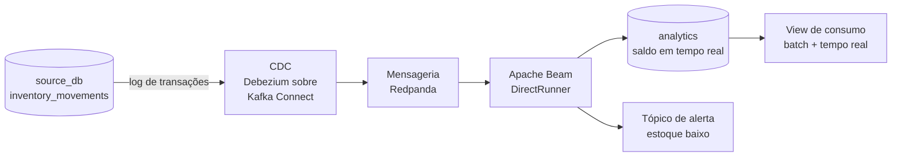

# Fluxo de Streaming de Estoque

> **O que vive aqui:** o micro-fluxo contínuo do projeto — captura de mudanças (CDC), transporte,
> processamento por tempo de evento, atualização de saldo e ramificação de alerta.
>
> **O que não vive aqui:** o contrato do evento e as *constraints* da tabela de origem (ver
> [Modelo de Dados](modelo_de_dados.md#5-contrato-do-evento-de-estoque)); o produtor que gera os
> eventos (ver [Geração de Dados](geracao_de_dados.md#6-produtor-de-eventos-de-estoque)); os testes
> do fluxo (ver [Qualidade de Dados](qualidade_de_dados.md)).

| Campo | Informação |
|---|---|
| Escopo | Um único domínio: `inventory_movements` |
| Decisões | [ADR-0006](adr/0006-streaming-de-estoque-com-cdc-e-beam.md) · [ADR-0019](adr/0019-saldo-em-deltas-com-entrega-idempotente.md) · [ADR-0020](adr/0020-debezium-sobre-kafka-connect.md) |
| Versão | 1.1 |
| Situação | Vigente — materialização, entrega, cursor e implantação fixados por ADR |
| Última revisão | 04/09/2026 |

---

## 1. Por que existe, e por que é pequeno

Um pipeline exclusivamente *batch* não exercita as questões mais difíceis de dados: ordenação,
duplicidade, eventos atrasados e correção retroativa. Um fluxo contínuo restrito a **um único
domínio** eleva o MVP de *batch* tradicional para uma arquitetura com caminho quente e caminho
frio — o padrão que a literatura chama de **Lambda** —, sem ferir o princípio **P6** (simplicidade
arquitetural).

`inventory_movements` foi escolhida por ser a única tabela do projeto modelada como livro de
eventos imutáveis: aceita somente inserções, e correções são eventos compensatórios. Isso a torna
naturalmente adequada a CDC.

O escopo é deliberadamente pequeno: **um domínio, um consumidor, um alerta**. Tudo o mais continua
em *batch*.

---

## 2. Arquitetura

| Camada | Fase local | Fase GCP |
|---|---|---|
| Captura (CDC) | **Debezium** como conector do **Kafka Connect**, lendo o log de transações do PostgreSQL ([ADR-0020](adr/0020-debezium-sobre-kafka-connect.md)) | **Datastream** lendo o log do Cloud SQL |
| Transporte | **Redpanda** — compatível com Kafka e muito mais leve para rodar em Docker | **Pub/Sub** |
| Processamento | **Apache Beam (Python)** com `DirectRunner` | **O mesmo código Beam** no **Dataflow** |
| Destino | Tabela de **deltas imutáveis** no `warehouse_db`, com o saldo como view sobre ela ([ADR-0019](adr/0019-saldo-em-deltas-com-entrega-idempotente.md)) | Tabela equivalente no BigQuery via *streaming inserts* |

A escolha do Apache Beam é o que sustenta a paridade (**P4**): o mesmo código de pipeline roda
localmente no `DirectRunner` e, na nuvem, distribuído no Dataflow. Trocam-se as pontas — origem e
destino —, não a lógica.

Toda a operação local é encapsulada nos alvos do `Makefile`: subir a fila, o CDC e o *job* de
streaming acontece pelo terminal, como o resto do projeto (ver
[Execução Local](execucao_local.md)).

### 2.1 Limites honestos da execução local

Três ressalvas que não devem ser confundidas com limitações do desenho:

- **O `DirectRunner` não é um executor de produção.** É monoprocesso, sem tolerância a falha e sem
  escala horizontal. Serve para desenvolver e demonstrar a lógica — que é o objetivo aqui —, e a
  execução com garantias reais acontece no Dataflow. Medições de latência feitas localmente valem
  como ordem de grandeza, nunca como resultado de desempenho.
- **O Debezium precisa de uma forma de implantação.** Ele não é um binário isolado: roda sobre
  Kafka Connect ou como **Debezium Server** autônomo publicando direto no transporte. Decisão
  pendente **D29** — Debezium Server evita subir o Connect e reduz o consumo de memória
  (risco **R11**), mas tem menos opções de configuração.
- **O CDC desta tabela captura apenas inserções.** `inventory_movements` é *append-only*, então
  `UPDATE` e `DELETE` no fluxo indicam defeito na origem, não evento de negócio: o conector é
  configurado para inserções e qualquer outra operação capturada deve **falhar o pipeline**, não
  ser processada em silêncio.

---

## 3. Semântica de processamento

### 3.1 Tempo de evento, não tempo de processamento

O Beam processa por **tempo de evento** (`occurred_at`, o momento em que a transação ocorreu na
origem), não por tempo de chegada. É essa escolha que torna o resultado estável mesmo quando a
ordem de chegada não é a ordem dos fatos.

### 3.2 Deduplicação e idempotência

O transporte garante entrega *at least once*, nunca *exactly once*. A deduplicação é
responsabilidade do consumidor: o pipeline usa a `idempotency_key` do evento (ou o **LSN** da
transação no PostgreSQL) como chave de deduplicação dentro de uma janela fixa, descartando
retransmissões.

O critério é objetivo: **processar a mesma mensagem duas vezes não pode alterar o resultado final**.

### 3.3 Eventos atrasados

Sistemas caem. Se um movimento chegar horas depois — porque o ponto de venda de uma loja física
ficou offline —, o pipeline usa *watermarks* e *allowed lateness* para recalcular a janela afetada
retroativamente e emitir a correção para o destino, em vez de ignorar o evento ou corromper a
janela já fechada.

O [produtor de eventos](geracao_de_dados.md#6-produtor-de-eventos-de-estoque) gera atrasos
propositais justamente para que esse caminho seja exercitado e testado.

---

## 4. Atualização contínua do saldo

Fazer `UPDATE` no destino a cada evento é caro em qualquer armazém analítico e inviável em um
armazém colunar como o BigQuery. O desenho é outro:

1. O pipeline agrega em **janelas curtas** (por exemplo, um minuto), somando entradas e saídas por
   SKU e armazém.
2. Insere o **delta** da janela em `inventory_balances_realtime` — inserção, nunca atualização.
3. Uma **view de consumo** unifica a fotografia diária produzida em *batch* pelo dbt com os deltas
   do streaming, entregando o saldo atualizado.

O resultado é um exemplo concreto de caminho quente e caminho frio convivendo sob um mesmo contrato
de consumo.

A forma foi fixada pelo [ADR-0019](adr/0019-saldo-em-deltas-com-entrega-idempotente.md):

- **a tabela de deltas é imutável** — nada é sobrescrito, e todo saldo é explicável movimento a
  movimento;
- **a entrega é *at-least-once* com escrita idempotente** por chave de evento: duplicata reescreve o
  mesmo registro em vez de somar duas vezes;
- **janela fixa de um minuto por tempo de evento**, com *allowed lateness* inicial de cinco minutos
  — número **não medido**, a calibrar na Etapa 7 (**P5**);
- **o cursor vive nos tópicos internos do Redpanda**, gerido pelo conector: nenhuma tabela
  participa da recuperação. A consequência operacional de restaurar o banco está em
  [Capacidade e Recuperação](capacidade_e_recuperacao.md#32-o-cursor-de-cdc-não-está-no-pacote--e-por-quê).

---

## 5. Ramificação de alerta

Dentro do pipeline Beam existe uma **ramificação**: quando o saldo atualizado de um SKU cai abaixo
de um limiar parametrizado, o fluxo emite um evento para um tópico separado de alerta.

Esse tópico é o ponto de extensão natural do projeto — pode disparar um webhook, alimentar um
painel ou acionar um processo de reposição. No MVP, basta que o evento seja emitido, registrado e
testado.

---

## 6. Convivência com o Airbyte

Os dois caminhos de ingestão não competem pela mesma tabela:

| Responsabilidade | Airbyte | Streaming |
|---|---|---|
| Carga histórica (*backfill*) de `inventory_movements` | Sim | Não |
| Ingestão incremental de `inventory_movements` | Não | **Sim — caminho oficial** |
| Reconciliação periódica em área separada | Sim | Não |
| Todas as demais 39 tabelas | **Sim** | Não |

A carga histórica acontece antes da ativação do streaming, registrando o último `event_sequence` e
o cursor de CDC; o consumidor parte do evento seguinte. A sobreposição entre *backfill* e streaming
é tolerada por deduplicação — nunca pode gerar duas linhas na fato para o mesmo movimento.

---

## 7. Decisões deste fluxo

Nenhuma pendente. As quatro foram fechadas em 04/09/2026:

| ID | Questão | ADR |
|---|---|---|
| **D16** | Materialização do saldo e da view unificada | [ADR-0019](adr/0019-saldo-em-deltas-com-entrega-idempotente.md) |
| **D17** | Semântica de entrega, latência e janela | [ADR-0019](adr/0019-saldo-em-deltas-com-entrega-idempotente.md) |
| **D18** | Cursor de CDC | [ADR-0019](adr/0019-saldo-em-deltas-com-entrega-idempotente.md) |
| **D29** | Forma de implantação do Debezium | [ADR-0020](adr/0020-debezium-sobre-kafka-connect.md) |

O único número ainda **não medido** é o *allowed lateness*, calibrado na Etapa 7.

---

## 8. Conceitos exercitados

CDC sobre log de transações · mensageria e consumo com *offset* · tempo de evento contra tempo de
processamento · *watermarks* e *allowed lateness* · janelas e gatilhos · idempotência e
deduplicação · entrega *at least once* · caminho quente e caminho frio sob um mesmo contrato de
consumo · portabilidade de pipeline entre executores.
