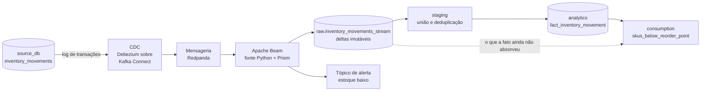

# Fluxo de Streaming de Estoque

> **O que vive aqui:** o micro-fluxo contínuo do projeto — captura de mudanças (CDC), transporte,
> processamento por tempo de evento, atualização de saldo e ramificação de alerta.
>
> **O que não vive aqui:** o contrato do evento e as *constraints* da tabela de origem (ver
> [Modelo de Dados](modelo_de_dados.md#5-contrato-do-evento-de-estoque)); o produtor que gera os
> eventos (ver [Geração de Dados](geracao_de_dados.md#6-produtor-de-eventos-de-estoque)); os testes
> do fluxo (ver [Qualidade de Dados](qualidade_de_dados.md)).

| Campo | Informação |
|---|---|
| Escopo | Um único domínio: `inventory_movements` |
| Decisões | [ADR-0006](adr/0006-streaming-de-estoque-com-cdc-e-beam.md) · [ADR-0019](adr/0019-saldo-em-deltas-com-entrega-idempotente.md) · [ADR-0020](adr/0020-debezium-sobre-kafka-connect.md) · [ADR-0031](adr/0031-aterrissagem-do-caminho-quente-em-raw.md) · [ADR-0032](adr/0032-fonte-python-no-lugar-do-kafkaio.md) |
| Versão | 2.0 |
| Situação | **Em operação** desde a Etapa 7 — construído, medido e reconciliado |
| Última revisão | 04/09/2026 |

---

## 1. Por que existe, e por que é pequeno

Um pipeline exclusivamente *batch* não exercita as questões mais difíceis de dados: ordenação,
duplicidade, eventos atrasados e correção retroativa. Um fluxo contínuo restrito a **um único
domínio** eleva o MVP de *batch* tradicional para uma arquitetura com caminho quente e caminho
frio — o padrão que a literatura chama de **Lambda** —, sem ferir o princípio **P6** (simplicidade
arquitetural).

`inventory_movements` foi escolhida por ser a única tabela do projeto modelada como livro de
eventos imutáveis: aceita somente inserções, e correções são eventos compensatórios. Isso a torna
naturalmente adequada a CDC.

O escopo é deliberadamente pequeno: **um domínio, um consumidor, um alerta**. Tudo o mais continua
em *batch*.

---

## 2. Arquitetura



| Camada | Fase local | Fase GCP |
|---|---|---|
| Captura (CDC) | **Debezium** como conector do **Kafka Connect**, lendo o log de transações do PostgreSQL ([ADR-0020](adr/0020-debezium-sobre-kafka-connect.md)) | **Datastream** lendo o log do Cloud SQL |
| Transporte | **Redpanda** — compatível com Kafka e muito mais leve para rodar em Docker | **Pub/Sub** |
| Processamento | **Apache Beam (Python)**, executor local — o `DirectRunner` delega ao **Prism**, que é quem suporta `DoFn` divisível não-limitado com estado e temporizadores | **O mesmo código Beam** no **Dataflow** |
| Destino | Tabela de **deltas imutáveis** em `raw`, ao lado da que o Airbyte escreve ([ADR-0019](adr/0019-saldo-em-deltas-com-entrega-idempotente.md), [ADR-0031](adr/0031-aterrissagem-do-caminho-quente-em-raw.md)) | Tabela equivalente no dataset `raw` do BigQuery, via *streaming inserts* |

A escolha do Apache Beam é o que sustenta a paridade (**P4**): o mesmo código de pipeline roda
localmente no `DirectRunner` e, na nuvem, distribuído no Dataflow. Trocam-se as pontas — origem e
destino —, não a lógica.

Toda a operação local é encapsulada nos alvos do `Makefile`: subir a fila, o CDC e o *job* de
streaming acontece pelo terminal, como o resto do projeto (ver
[Execução Local](execucao_local.md)).

### 2.1 Limites honestos da execução local

Quatro ressalvas que não devem ser confundidas com limitações do desenho:

- **O executor local não é um executor de produção.** O `DirectRunner` do Beam 2.76 delega a
  pipelines contínuos ao **Prism**, que roda em um processo próprio ao lado do Python. É local, sem
  tolerância a falha e sem escala horizontal. Serve para desenvolver e demonstrar a lógica — que é o
  objetivo aqui —, e a execução com garantias reais acontece no Dataflow. Medições de latência
  feitas localmente valem como ordem de grandeza, nunca como resultado de desempenho.
- **A ponta de leitura não é a classe que o Beam oferece.** O `ReadFromKafka` é transformação
  *cross-language* implementada em Java, e exigiria duas peças Java em execução ao lado do Redpanda
  e do Kafka Connect. A leitura aqui é um `DoFn` divisível não-limitado escrito em Python, com a
  mesma semântica — restrição por partição, avanço por *offset*, autocheckpoint e *watermark*
  estimado por atraso limitado. **A paridade de código na leitura não existe; a de semântica sim**,
  e a diferença está registrada no [ADR-0032](adr/0032-fonte-python-no-lugar-do-kafkaio.md). Tudo o
  mais no *pipeline* é Beam idiomático e atravessa para o Dataflow sem alteração.
- **O executor local não persiste estado entre execuções.** O saldo corrente por SKU vive em estado
  de `DoFn`, e uma subida limpa começaria do zero — o número que o alerta chama de "saldo" seria
  apenas o que aquele processo viu. O tratamento é semear o estado a partir dos deltas já duráveis
  no destino, com corte temporal exato. O Dataflow persiste o estado e dispensaria a semeadura; ela
  existe para que o mesmo código dê o mesmo resultado nos dois, que é o ponto do **P4**.
- **O CDC desta tabela captura apenas inserções.** `inventory_movements` é *append-only*, então
  `UPDATE` e `DELETE` no fluxo indicam defeito na origem, não evento de negócio: o conector é
  configurado para inserções e qualquer outra operação capturada deve **falhar o pipeline**, não
  ser processada em silêncio.

---

## 3. Semântica de processamento

### 3.1 Tempo de evento, não tempo de processamento

O Beam processa por **tempo de evento** (`occurred_at`, o momento em que a transação ocorreu na
origem), não por tempo de chegada. É essa escolha que torna o resultado estável mesmo quando a
ordem de chegada não é a ordem dos fatos.

### 3.2 Deduplicação e idempotência

O transporte garante entrega *at least once*, nunca *exactly once*. A deduplicação é
responsabilidade do consumidor: o pipeline usa a `idempotency_key` do evento (ou o **LSN** da
transação no PostgreSQL) como chave de deduplicação dentro de uma janela fixa, descartando
retransmissões.

O critério é objetivo: **processar a mesma mensagem duas vezes não pode alterar o resultado final**.

A deduplicação na janela é otimização; **a garantia é a escrita idempotente no destino**, e é ela
que define a fronteira: só segue para o cálculo de saldo o evento que o `on conflict` deixou entrar.
Sem essa ordem, uma duplicata que chegasse depois da janela seria barrada na tabela e ainda assim
somada duas vezes no saldo — é a mesma fronteira que o `staging` é para o caminho frio, no lugar
equivalente.

### 3.3 Eventos atrasados

Sistemas caem. Se um movimento chegar horas depois — porque o ponto de venda de uma loja física
ficou offline —, o pipeline usa *watermarks* e *allowed lateness* para recalcular a janela afetada
retroativamente e emitir a correção para o destino, em vez de ignorar o evento ou corromper a
janela já fechada.

O [produtor de eventos](geracao_de_dados.md#6-produtor-de-eventos-de-estoque) gera atrasos
propositais justamente para que esse caminho seja exercitado e testado.

**A tolerância a atraso foi medida na Etapa 7, e a hipótese caiu.** O ADR-0019 registrou cinco
minutos como palpite explícito. A distribuição real de `recorded_at − occurred_at` sobre os 15.446
movimentos tem **mediana de 403 s** e cauda em **900 s** — cinco minutos ficavam *abaixo da
mediana*, e a maior parte dos eventos atrasados seria descartada da janela sem que nada falhasse. O
valor vigente é de **1200 s**, dimensionado pelo teto que a origem declara e não pela cauda medida:
o teto não muda quando o dado muda. O número e a medição estão em
[`streaming/fluxo.yml`](../streaming/fluxo.yml).

---

## 4. Atualização contínua do saldo

Fazer `UPDATE` no destino a cada evento é caro em qualquer armazém analítico e inviável em um
armazém colunar como o BigQuery. O desenho é outro, e o
[ADR-0019](adr/0019-saldo-em-deltas-com-entrega-idempotente.md) o fixou:

1. O pipeline grava **um delta imutável por movimento** em `raw.inventory_movements_stream` —
   inserção, nunca atualização, idempotente por `movement_id`.
2. O **saldo é uma soma** desses deltas. Não existe tabela de saldo mantida pelo fluxo.
3. Uma **view de consumo** compõe o que a fato já absorveu com o que só existe no caminho quente,
   entregando a posição atual sob um contrato só.

> **Correção do que este documento dizia até 04/09/2026.** As versões anteriores descreviam o
> pipeline agregando por janela e inserindo *o delta da janela* em uma tabela `inventory_balances_realtime`.
> Essa é exatamente a alternativa que o ADR-0019 **recusou** — *"o agregado vira a fonte da verdade:
> janela processada errado não tem de onde ser reconstruída"*. O ADR é posterior e vence; esta seção
> estava desatualizada, e a Etapa 7 construiu o que o ADR decidiu.

A janela de um minuto continua existindo, com outra função: ela agrega por armazém e SKU para
**avaliar o limiar do alerta**, não para armazenar. É a diferença entre usar a janela como cálculo e
usá-la como memória — e é a memória que o ADR recusou.

O resto da decisão, aplicado:

- **a tabela de deltas é imutável** — nada é sobrescrito, e todo saldo é explicável movimento a
  movimento;
- **a entrega é *at-least-once* com escrita idempotente** por `movement_id`: duplicata não escreve
  nem soma duas vezes, e é essa escrita que serve de fronteira exatamente-uma-vez para tudo o que
  vem depois dela no grafo;
- **janela fixa de um minuto por tempo de evento**, com *allowed lateness* **medido** na Etapa 7 e
  fixado em 1200 s (ver §3.3);
- **o cursor do CDC vive nos tópicos internos do Redpanda**, gerido pelo conector: nenhuma tabela
  participa da recuperação. A consequência operacional de restaurar o banco está em
  [Capacidade e Recuperação](capacidade_e_recuperacao.md#32-o-cursor-de-cdc-não-está-no-pacote--e-por-quê).

### 4.1 Onde o quente e o frio se encontram

A composição está na view `skus_below_reorder_point`, que responde à **P12**:

```
frio    ← fact_inventory_movement          tudo que o dbt já absorveu
quente  ← raw.inventory_movements_stream   o que a fato **ainda não** contém
saldo   ← frio + quente
```

**A fronteira é a chave do evento, não o tempo.** O corte óbvio — "eventos posteriores ao último que
a fato viu" — perderia exatamente o caso que o fluxo existe para tratar: um movimento que *ocorreu*
antes dessa fronteira e *chegou* depois dela cairia fora dos dois lados e sumiria do saldo. A
fronteira é a ausência do `movement_id` na fato, que é exata e não depende de relógio.

A view expõe as duas parcelas separadas — `quantity_from_batch` e `quantity_from_stream` — de
propósito: sem elas ninguém consegue dizer se um saldo estranho veio do lote ou do fluxo, e o
caminho quente vira caixa-preta na única view que o consome.

---

## 5. Ramificação de alerta

Dentro do pipeline existe uma **ramificação**: quando o saldo de um par armazém/SKU cruza o ponto de
reposição, o fluxo emite um evento em `mvp.alerts.inventory_low_stock` — tópico separado de
propósito, porque alerta é sinal para outro sistema, não linha de dado.

Três decisões de semântica que só aparecem construindo:

- **Alerta é borda, não nível.** Emitir a cada evento enquanto o saldo está abaixo do limiar
  afogaria o tópico. O que se emite é a travessia: `abertura` quando o saldo cai abaixo, e
  `normalizacao` quando volta. Alerta que nunca se fecha vira ruído, e quem consome precisa saber
  que passou.
- **O *snapshot* inicial não alerta.** Ele reproduz dois anos e meio de livro, e alertar em cada
  travessia histórica encheria o tópico de avisos sobre estoque de 2024. O painel formado só por
  eventos do *snapshot* constrói o saldo e não avisa sobre ele — que é o que um sistema real faz ao
  carregar estado inicial.
- **Alerta nascido de painel atrasado é correção**, e vai marcado como tal: é uma janela já fechada
  sendo reaberta, não um fato novo. Quem consome o tópico precisa distinguir os dois casos.

O limiar é parâmetro, e não coluna da origem: `inventory_balances` não tem ponto de reposição, e
inventá-lo exigiria migração, regeração e um ADR que ninguém pediu. O valor vive em
[`streaming/fluxo.yml`](../streaming/fluxo.yml), espelhado em `dbt_project.yml` para a view da P12 —
com um teste do `pytest` conferindo que os dois concordam, pelo mesmo arranjo de `as_of_date`.

---

## 6. Convivência com o Airbyte

Os dois caminhos não competem pela mesma responsabilidade:

| Responsabilidade | Airbyte | Streaming |
|---|---|---|
| Ingestão incremental de `inventory_movements` | Não — deixou de ser `append` na Etapa 7 | **Sim — caminho oficial** |
| Carga histórica (*backfill*) | Sim, por carga completa | **Sim, pelo *snapshot* inicial do conector** |
| Reconciliação: a segunda opinião sobre o mesmo livro | **Sim — é o novo papel dele** | Não |
| Todas as demais 39 tabelas | **Sim** | Não |

O [ADR-0031](adr/0031-aterrissagem-do-caminho-quente-em-raw.md) deu a essa área de reconciliação —
prometida por este documento desde a Etapa 5 e até então inexistente — um lugar concreto:
`raw.inventory_movements` continua sendo carregada pelo Airbyte, agora em `full_refresh` e fora do
caminho crítico, e é contra ela que o teste `caminhos_de_ingestao_reconciliam` pergunta se o CDC
perdeu algum evento.

**A sobreposição entre os dois é total, e é de propósito.** Com `snapshot.mode=initial`, o caminho
quente carrega o livro inteiro, exatamente como o Airbyte. É essa sobreposição que dá à deduplicação
do `staging` algo que provar: se ela falhar, a fato dobra de tamanho e nada mais fecha.

As duas se encontram em `stg_retail__inventory_movements`, deduplicadas por `movement_id`, e o
modelo registra **por qual caminho cada movimento chegou** — `arrived_by_stream` e
`arrived_by_batch`. São linhagem, não conveniência: evento que chegou só pelo lote é lacuna no CDC,
e evento que chegou só pelo fluxo é carga de reconciliação atrasada. Sem as duas colunas, nenhum dos
dois sintomas é visível.

---

## 7. Decisões deste fluxo

Nenhuma pendente.

| ID | Questão | ADR |
|---|---|---|
| **D16** | Materialização do saldo e da view unificada | [ADR-0019](adr/0019-saldo-em-deltas-com-entrega-idempotente.md) |
| **D17** | Semântica de entrega, latência e janela | [ADR-0019](adr/0019-saldo-em-deltas-com-entrega-idempotente.md) |
| **D18** | Cursor de CDC | [ADR-0019](adr/0019-saldo-em-deltas-com-entrega-idempotente.md) |
| **D29** | Forma de implantação do Debezium | [ADR-0020](adr/0020-debezium-sobre-kafka-connect.md) |
| — | Onde o caminho quente aterrissa, quem faz o seu *backfill*, e o novo papel do Airbyte | [ADR-0031](adr/0031-aterrissagem-do-caminho-quente-em-raw.md) |
| — | Como o pipeline lê o transporte sem Java na máquina | [ADR-0032](adr/0032-fonte-python-no-lugar-do-kafkaio.md) |

O *allowed lateness*, único número que o ADR-0019 deixou rotulado como **não medido**, foi medido na
Etapa 7 e corrigido de 300 s para 1200 s (§3.3).

---

### 7.1 O que foi medido

Medições de 04/09/2026, no ambiente descrito em
[Capacidade e Recuperação](capacidade_e_recuperacao.md). Todo número aqui foi observado; nenhum foi
estimado (**P5**).

| Observação | Valor |
|---|---|
| Movimentos entregues pelo *snapshot* inicial do conector | 13.746 |
| Eventos novos produzidos ao vivo | 2.200 |
| Linhas em `raw.inventory_movements_stream` — o caminho quente | 15.946 |
| Linhas em `raw.inventory_movements` — a carga de reconciliação | 15.450 |
| Entregas somadas que o `staging` recebeu | 31.396 |
| Movimentos **distintos**, e linhas em `staging` | 15.946 |
| Linhas em `fact_inventory_movement` | **15.946 — nem uma a mais** |
| Movimentos que chegaram **só** por um dos caminhos | **0**, logo após a carga de reconciliação |
| Objetos dbt construídos com os dois caminhos | **262, zero erro** |
| Saldo reconstruído pelo caminho quente contra a projeção da origem | **2.910 pares, 701.851 unidades — idênticos** |
| Duplicatas injetadas no transporte | 250 |
| Linhas gravadas por elas | **0** — contagem e saldo inalterados |
| Alertas emitidos | 75 — 36 aberturas, 39 normalizações |
| Alertas que são **correção de evento atrasado** | 6 |
| Atraso de registro na origem | p50 403 s · p95 851 s · p99 890 s · máx 900 s |
| DAG `fluxo_batch` com o caminho quente em operação | 8 tarefas verdes, 3 min 10 s |

**O que a linha do meio prova.** O `staging` recebeu 31.396 entregas e devolveu 15.946 movimentos —
descartou 15.450 redundâncias e não perdeu uma. A sobreposição entre os dois caminhos é de 100% por
construção (`snapshot.mode=initial`), e é isso que torna o número uma prova em vez de uma
coincidência: se a deduplicação falhasse por pouco, a fato teria dobrado.

---

## 8. Conceitos exercitados

CDC sobre log de transações · mensageria e consumo com *offset* · tempo de evento contra tempo de
processamento · *watermarks* e *allowed lateness* · janelas e gatilhos · idempotência e
deduplicação · entrega *at least once* · caminho quente e caminho frio sob um mesmo contrato de
consumo · portabilidade de pipeline entre executores.
